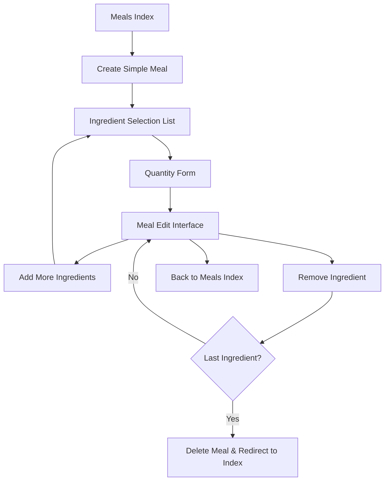

# Design Document: Modern Meal Creation System

## Overview

This design modernizes the meal creation system to mirror the successful simple workout creation pattern. The system will replace the traditional Laravel views with a flexible component-based interface that allows incremental ingredient addition, similar to how users add exercises to workouts.

The key architectural change is moving from a single-form approach to a multi-step workflow: ingredient selection → quantity specification → meal building, with each step using the flexible component system for consistent mobile-friendly UX.

## Architecture

### High-Level Flow



### Component Architecture

The system follows the same architectural patterns as `SimpleWorkoutController`:

1. **Controller Layer**: `SimpleMealController` handles routing and business logic
2. **Service Layer**: `MealIngredientListService` generates component data
3. **Component Layer**: Uses `ComponentBuilder` for consistent UI
4. **Model Layer**: Existing `Meal`, `Ingredient`, and pivot relationships

## Components and Interfaces

### SimpleMealController

Controller that completely replaces the existing `MealController`:

```php
class SimpleMealController extends Controller
{
    protected $ingredientListService;
    protected $nutritionService;
    
    public function __construct(
        MealIngredientListService $ingredientListService,
        NutritionService $nutritionService
    ) {
        $this->ingredientListService = $ingredientListService;
        $this->nutritionService = $nutritionService;
    }
    
    // Core CRUD methods (replacing MealController)
    public function index()                                     // List all meals
    public function create()                                    // Show ingredient selection
    public function edit(Meal $meal)                           // Modern meal edit interface
    public function destroy(Meal $meal)                        // Delete meal
    
    // Ingredient management methods
    public function addIngredient(Request $request, Meal $meal = null)  // Show quantity form
    public function storeIngredient(Request $request, Meal $meal = null) // Add ingredient with quantity
    public function updateQuantity(Request $request, Meal $meal, $ingredientId) // Update existing quantity
    public function removeIngredient(Meal $meal, $ingredientId) // Remove ingredient
}
```

### MealIngredientListService

Service class responsible for generating component data, similar to `WorkoutExerciseListService`:

```php
class MealIngredientListService
{
    protected $nutritionService;
    
    public function generateIngredientSelectionList(Meal $meal = null): array
    public function generateIngredientListTable(Meal $meal): array
    public function generateQuantityForm(Ingredient $ingredient, Meal $meal = null, float $currentQuantity = null): array
}
```

### Route Structure

Replacing existing meal routes entirely:

```php
// Core meal routes (replacing existing MealController routes)
Route::get('meals', [SimpleMealController::class, 'index'])
    ->name('meals.index');
Route::get('meals/create', [SimpleMealController::class, 'create'])
    ->name('meals.create');
Route::get('meals/{meal}/edit', [SimpleMealController::class, 'edit'])
    ->name('meals.edit');
Route::delete('meals/{meal}', [SimpleMealController::class, 'destroy'])
    ->name('meals.destroy');

// Ingredient management
Route::get('meals/new/add-ingredient', [SimpleMealController::class, 'addIngredient'])
    ->name('meals.add-ingredient-new');
Route::post('meals/new/store-ingredient', [SimpleMealController::class, 'storeIngredient'])
    ->name('meals.store-ingredient-new');
Route::get('meals/{meal}/add-ingredient', [SimpleMealController::class, 'addIngredient'])
    ->name('meals.add-ingredient');
Route::post('meals/{meal}/store-ingredient', [SimpleMealController::class, 'storeIngredient'])
    ->name('meals.store-ingredient');
Route::get('meals/{meal}/ingredients/{ingredient}/edit-quantity', [SimpleMealController::class, 'updateQuantity'])
    ->name('meals.edit-quantity');
Route::delete('meals/{meal}/ingredients/{ingredient}', [SimpleMealController::class, 'removeIngredient'])
    ->name('meals.remove-ingredient');
```

## Data Models

### Existing Models (No Changes Required)

The system leverages existing models without modification:

- **Meal**: `id`, `name`, `comments`, `user_id`, `created_at`, `updated_at`
- **Ingredient**: All existing fields including nutritional data
- **MealIngredient** (pivot): `meal_id`, `ingredient_id`, `quantity`

### Model Relationships

No changes to existing relationships:
- `Meal::ingredients()` - belongsToMany with quantity pivot
- `Ingredient::meals()` - belongsToMany with quantity pivot

## Error Handling

### Validation Errors
- **Invalid Quantities**: Quantities must be numeric and greater than 0.01
- **Missing Ingredients**: Ingredient must exist and belong to the user
- **Duplicate Ingredients**: Prevent adding ingredients already in the meal
- **Empty Meals**: Handle meal deletion when last ingredient is removed

### User Experience Errors
- **Navigation Errors**: Graceful handling of invalid meal/ingredient IDs
- **Permission Errors**: Ensure users can only access their own meals
- **Form Errors**: Clear error messages for invalid form submissions

### Database Errors
- **Constraint Violations**: Handle foreign key and unique constraints
- **Transaction Failures**: Ensure data consistency during multi-step operations
- **Connection Issues**: Graceful degradation for database connectivity problems

## Testing Strategy

### Unit Testing
- Test individual controller methods with various inputs
- Test service class methods for component generation
- Test model relationships and data validation
- Test error handling for edge cases

### Integration Testing
- Test complete user workflows from ingredient selection to meal completion
- Test compatibility with existing meal logging functionality
- Test mobile interface responsiveness and component rendering
- Test database transactions and data persistence

## Implementation Details

### Controller Method Specifications

#### `SimpleMealController::create()`
```php
public function create()
{
    $components = [];
    
    // Title
    $components[] = C::title('Create Meal')->build();
    
    // Info message
    $components[] = C::messages()
        ->info('Select ingredients below to add them to your meal.')
        ->build();
    
    // Ingredient selection list - always expanded on create page
    $ingredientSelectionList = $this->ingredientListService->generateIngredientSelectionListForNew(Auth::id());
    $components[] = $ingredientSelectionList;
    
    $data = ['components' => $components];
    return view('mobile-entry.flexible', compact('data'));
}
```

#### `SimpleMealController::addIngredient()`
```php
public function addIngredient(Request $request, Meal $meal = null)
{
    $ingredientId = $request->input('ingredient');
    
    if (!$ingredientId) {
        return redirect()->back()->with('error', 'No ingredient specified.');
    }
    
    $ingredient = Ingredient::where('id', $ingredientId)
        ->where('user_id', Auth::id())
        ->first();
    
    if (!$ingredient) {
        return redirect()->back()->with('error', 'Ingredient not found.');
    }
    
    // Check for duplicates if meal exists
    if ($meal && $meal->ingredients()->where('ingredient_id', $ingredient->id)->exists()) {
        return redirect()
            ->route('meals.edit', $meal->id)
            ->with('warning', 'Ingredient already in meal.');
    }
    
    // Generate quantity form
    $form = $this->ingredientListService->generateQuantityForm($ingredient, $meal);
    
    return view('mobile-entry.flexible', ['data' => ['components' => [$form]]]);
}
```

#### `SimpleMealController::storeIngredient()`
```php
public function storeIngredient(Request $request, Meal $meal = null)
{
    $validated = $request->validate([
        'ingredient_id' => 'required|exists:ingredients,id',
        'quantity' => 'required|numeric|min:0.01',
        'meal_name' => 'nullable|string|max:255',
    ]);
    
    $ingredient = Ingredient::where('id', $validated['ingredient_id'])
        ->where('user_id', Auth::id())
        ->first();
    
    if (!$ingredient) {
        return redirect()->back()->with('error', 'Ingredient not found.');
    }
    
    // Create meal if it doesn't exist (first ingredient being added)
    if (!$meal) {
        $meal = Meal::create([
            'user_id' => Auth::id(),
            'name' => $validated['meal_name'] ?: 'New Meal',
            'comments' => null,
        ]);
    } else {
        $this->authorize('update', $meal);
    }
    
    // Check for duplicates
    if ($meal->ingredients()->where('ingredient_id', $ingredient->id)->exists()) {
        return redirect()
            ->route('meals.edit', $meal->id)
            ->with('warning', 'Ingredient already in meal.');
    }
    
    // Add ingredient to meal
    $meal->ingredients()->attach($ingredient->id, ['quantity' => $validated['quantity']]);
    
    return redirect()
        ->route('meals.edit', $meal->id)
        ->with('success', 'Ingredient added!');
}
```

### Service Method Specifications

#### `MealIngredientListService::generateIngredientSelectionList()`
```php
public function generateIngredientSelectionList(Meal $meal): array
{
    $userId = Auth::id();
    
    // Get user's ingredients
    $ingredients = Ingredient::where('user_id', $userId)
        ->orderBy('name', 'asc')
        ->get();
    
    // Get ingredients already in this meal
    $mealIngredientIds = $meal->ingredients()->pluck('ingredient_id')->toArray();
    
    $items = [];
    
    foreach ($ingredients as $ingredient) {
        // Skip ingredients already in meal
        if (in_array($ingredient->id, $mealIngredientIds)) {
            continue;
        }
        
        $items[] = [
            'id' => 'ingredient-' . $ingredient->id,
            'name' => $ingredient->name,
            'href' => route('meals.add-ingredient', [
                $meal->id,
                'ingredient' => $ingredient->id
            ])
        ];
    }
    
    $itemListBuilder = C::itemList()
        ->filterPlaceholder('Search ingredients...')
        ->noResultsMessage('No ingredients found.')
        ->initialState('collapsed');
    
    foreach ($items as $item) {
        $itemListBuilder->item(
            $item['id'],
            $item['name'],
            $item['href']
        );
    }
    
    // Add create form for new ingredients
    $itemListBuilder->createForm(
        route('ingredients.store'),
        'name',
        ['redirect_to' => 'meals.edit', 'meal_id' => $meal->id],
        'Create "{term}"',
        'POST'
    );
    
    return $itemListBuilder->build();
}
```

### Database Migration Requirements

No new migrations required - the system uses existing tables:
- `meals` table (existing)
- `meal_ingredients` pivot table (existing)
- `ingredients` table (existing)

### Route Integration

The new controller completely replaces the existing MealController:

```php
// Remove existing MealController routes entirely
// Replace with SimpleMealController routes using standard meal route names

// In routes/web.php, replace:
// Route::resource('meals', MealController::class)->except(['show']);

// With the new routes shown in the Route Structure section above
```

### Files to Remove

The following existing files should be deleted:
- `app/Http/Controllers/MealController.php`
- `resources/views/meals/create.blade.php`
- `resources/views/meals/edit.blade.php`
- Any other meal-related blade templates
```