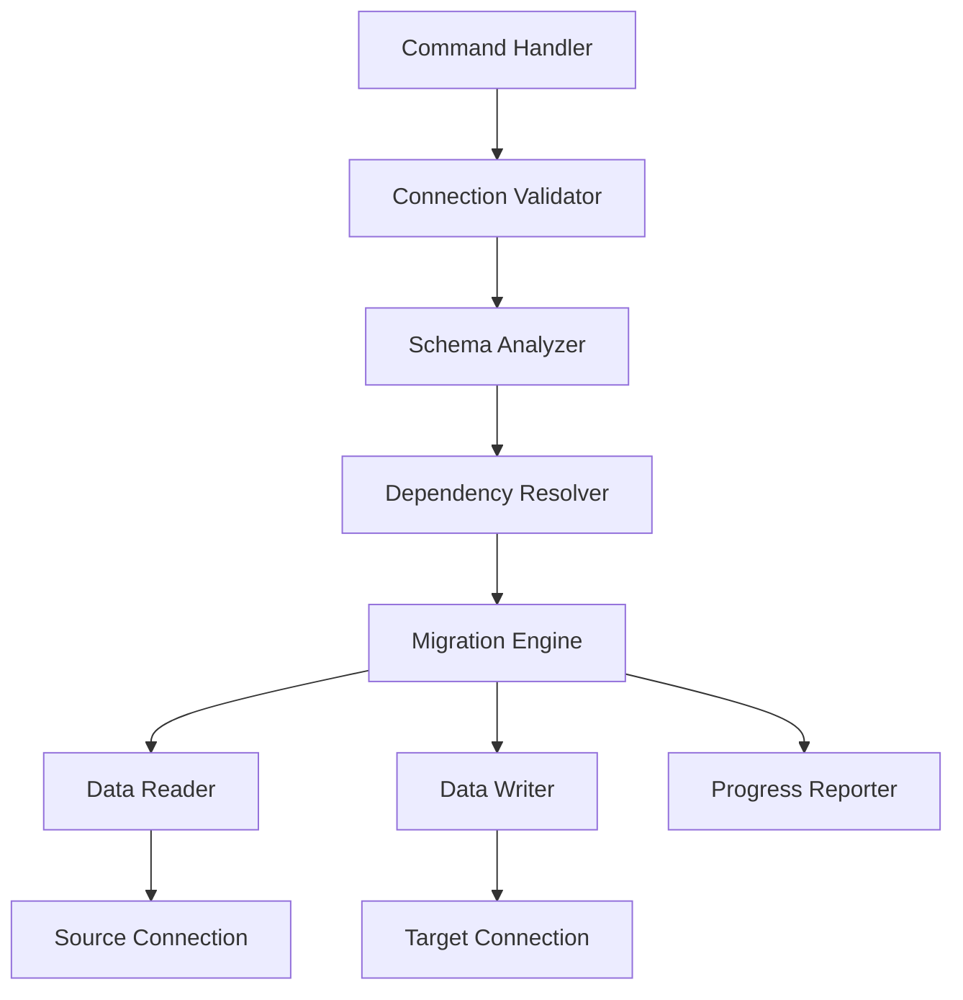

# Design Document

## Overview

This feature implements a Laravel Artisan console command that migrates all database data directly from one database connection to another. The command uses Laravel's database abstraction layer to read from a source connection and write to a target connection, enabling seamless migration between SQLite and MySQL databases without intermediate files.

The design focuses on:
- Data transfer between SQLite and MySQL using Laravel's Query Builder
- Proper handling of foreign key dependencies and constraints
- Transaction safety with rollback capabilities
- Progress reporting and dry-run mode for validation
- Flexible connection configuration using Laravel's existing database config

## Architecture

### Command Structure

```
MigrateDatabaseCommand
├── Signature: db:migrate-data {--from=} {--to=} {--fresh} {--dry-run} {--verbose}
├── Validation Layer
│   ├── Connection validation
│   ├── Schema compatibility checks
│   └── Dependency analysis
├── Migration Engine
│   ├── Table discovery
│   ├── Dependency resolution
│   ├── Data transfer
│   └── Progress tracking
└── Output Layer
    ├── Progress indicators
    ├── Summary statistics
    └── Error reporting
```

### Data Flow

```
Source Connection → Table Discovery → Dependency Ordering → 
Data Reading (chunked) → Data Writing (batched) → Target Connection
```

### Component Interaction



## Components and Interfaces

### 1. MigrateDatabaseCommand (Console Command)

**Responsibility**: Main command orchestration and user interaction

**Key Methods**:
- `handle()`: Main execution flow
- `validateConnections()`: Verify source and target connections exist and are accessible
- `confirmFreshMigration()`: Prompt user for confirmation when using --fresh
- `displaySummary()`: Show final migration statistics

**Command Signature**:
```php
protected $signature = 'db:migrate-data 
    {--from= : Source database connection name (defaults to default connection)}
    {--to= : Target database connection name (required)}
    {--fresh : Truncate all tables in target database before migrating}
    {--dry-run : Preview migration without making changes}
    {--verbose : Display detailed progress information}';
```

### 2. ConnectionValidator

**Responsibility**: Validate database connections and compatibility

**Key Methods**:
- `validateConnection(string $connectionName): bool`: Check if connection exists and is accessible
- `getConnectionDriver(string $connectionName): string`: Get database driver type
- `testConnection(string $connectionName): bool`: Test actual database connectivity
- `getAvailableConnections(): array`: List all configured connections

**Returns**: Validation results with error messages

### 3. SchemaAnalyzer

**Responsibility**: Discover and analyze database schema

**Key Methods**:
- `getTables(string $connectionName): array`: Get all table names from connection
- `getTableColumns(string $connectionName, string $table): array`: Get column definitions
- `getForeignKeys(string $connectionName, string $table): array`: Get foreign key relationships
- `getTableSchema(string $connectionName): array`: Get complete schema information

**Data Structure**:
```php
[
    'table_name' => [
        'columns' => ['id', 'name', 'created_at', ...],
        'foreign_keys' => [
            ['column' => 'user_id', 'references' => 'users', 'on' => 'id']
        ]
    ]
]
```

### 4. DependencyResolver

**Responsibility**: Order tables based on foreign key dependencies

**Key Methods**:
- `resolveDependencies(array $schema): array`: Return tables in dependency order
- `buildDependencyGraph(array $schema): array`: Create dependency graph
- `topologicalSort(array $graph): array`: Sort tables topologically
- `detectCircularDependencies(array $graph): array`: Identify circular references

**Algorithm**: Topological sort with cycle detection

**Output**: Ordered array of table names ensuring parent tables are migrated before children

### 5. MigrationEngine

**Responsibility**: Core data transfer logic

**Key Methods**:
- `migrate(array $tables, string $from, string $to, array $options): array`: Execute migration
- `migrateTable(string $table, string $from, string $to, array $options): int`: Migrate single table
- `truncateTable(string $table, string $connection): void`: Clear table data
- `disableForeignKeyChecks(string $connection): void`: Disable FK constraints
- `enableForeignKeyChecks(string $connection): void`: Enable FK constraints

**Options**:
```php
[
    'fresh' => bool,      // Truncate before migrating
    'dry_run' => bool,    // Preview only
    'verbose' => bool,    // Detailed output
    'chunk_size' => int   // Records per batch (default: 1000)
]
```

### 6. DataReader

**Responsibility**: Read data from source connection in chunks

**Key Methods**:
- `readTable(string $table, string $connection, int $chunkSize): Generator`: Yield data chunks
- `getRecordCount(string $table, string $connection): int`: Get total records
- `readChunk(string $table, string $connection, int $offset, int $limit): array`: Read specific chunk

**Implementation**: Uses Laravel's `chunk()` method for memory efficiency

### 7. DataWriter

**Responsibility**: Write data to target connection in batches

**Key Methods**:
- `writeRecords(string $table, array $records, string $connection): int`: Insert records
- `prepareRecord(array $record, array $columns): array`: Sanitize and prepare data
- `handleDuplicates(string $table, array $records, string $connection): int`: Handle unique constraint violations

**Strategy**: Use `DB::table()->insert()` with batch inserts for performance

### 8. ProgressReporter

**Responsibility**: Display progress and statistics

**Key Methods**:
- `startTable(string $table, int $totalRecords): void`: Initialize table progress
- `updateProgress(int $recordsProcessed): void`: Update progress bar
- `completeTable(string $table, int $recordsMigrated): void`: Finalize table stats
- `displaySummary(array $stats): void`: Show final summary

**Output Format**:
```
Migrating: users
[████████████████████████████] 100% (1,234 records)

Migrating: exercises
[████████████████████████████] 100% (5,678 records)

Summary:
  Tables migrated: 15
  Total records: 12,345
  Duration: 2m 34s
```

## Data Models

### Migration Statistics

```php
[
    'tables_migrated' => int,
    'total_records' => int,
    'records_per_table' => [
        'table_name' => int
    ],
    'skipped_records' => int,
    'duration_seconds' => float,
    'start_time' => Carbon,
    'end_time' => Carbon
]
```

### Table Schema

```php
[
    'name' => string,
    'columns' => [
        'column_name' => [
            'type' => string,
            'nullable' => bool,
            'default' => mixed
        ]
    ],
    'foreign_keys' => [
        [
            'column' => string,
            'references_table' => string,
            'references_column' => string,
            'on_delete' => string,
            'on_update' => string
        ]
    ],
    'indexes' => [
        [
            'name' => string,
            'columns' => array,
            'unique' => bool
        ]
    ]
]
```

## Error Handling

### Error Categories

1. **Connection Errors**
   - Connection not found in config
   - Unable to connect to database
   - Authentication failure
   - Network timeout

2. **Schema Errors**
   - Table not found in target
   - Column mismatch between source and target
   - Incompatible data types
   - Missing foreign key references

3. **Data Errors**
   - Unique constraint violation
   - Foreign key constraint violation
   - Data type conversion failure
   - NULL constraint violation

4. **Transaction Errors**
   - Transaction rollback failure
   - Deadlock detection
   - Lock timeout

### Error Handling Strategy

```php
try {
    DB::connection($target)->beginTransaction();
    
    foreach ($tables as $table) {
        try {
            $this->migrateTable($table, $source, $target, $options);
        } catch (QueryException $e) {
            if ($this->isForeignKeyViolation($e)) {
                $this->warn("Skipping record due to FK constraint: {$e->getMessage()}");
                continue;
            }
            throw $e;
        }
    }
    
    DB::connection($target)->commit();
} catch (Exception $e) {
    DB::connection($target)->rollBack();
    $this->error("Migration failed: {$e->getMessage()}");
    return Command::FAILURE;
}
```

### Rollback Strategy

- All migrations wrapped in database transaction
- Automatic rollback on any error
- Target database state preserved on failure
- Detailed error logging for debugging

## Testing Strategy

### Unit Tests

1. **ConnectionValidator Tests**
   - Test valid connection validation
   - Test invalid connection handling
   - Test connection driver detection
   - Test available connections listing

2. **SchemaAnalyzer Tests**
   - Test table discovery
   - Test column information retrieval
   - Test foreign key detection
   - Test schema comparison

3. **DependencyResolver Tests**
   - Test simple dependency ordering
   - Test complex dependency chains
   - Test circular dependency detection
   - Test independent table handling

4. **DataReader Tests**
   - Test chunked reading
   - Test record count accuracy
   - Test empty table handling
   - Test large dataset handling

5. **DataWriter Tests**
   - Test batch insertion
   - Test duplicate handling
   - Test data type conversion
   - Test constraint violation handling


### Feature Tests

1. **SQLite to MySQL Migration**
   - Test complete data migration from SQLite to MySQL
   - Test data type conversion (boolean, datetime, JSON)
   - Test foreign key preservation
   - Test data integrity after migration

2. **MySQL to SQLite Migration**
   - Test complete data migration from MySQL to SQLite
   - Test data type conversion
   - Test constraint preservation

3. **Command Execution Tests**
   - Test command with valid arguments
   - Test command with missing required arguments
   - Test command with invalid connection names
   - Test command output formatting

4. **Progress Reporting Tests**
   - Test progress bar display
   - Test verbose output
   - Test summary statistics
   - Test dry-run output

5. **Fresh Migration Tests**
   - Test --fresh option truncates tables
   - Test --fresh option requires confirmation
   - Test --fresh option with foreign keys

6. **Dry Run Tests**
   - Test dry-run mode doesn't modify target
   - Test dry-run output accuracy
   - Test dry-run validation

7. **Error Recovery Tests**
   - Test rollback on failure
   - Test partial migration handling
   - Test constraint violation recovery

## Implementation Notes

### SQLite and MySQL Considerations

1. **Data Type Mapping**
   - Use Laravel's schema builder types
   - Let Laravel handle type conversions
   - Test common type conversions (boolean, datetime, JSON)

2. **Boolean Handling**
   - SQLite: 0/1 integers
   - MySQL: TINYINT(1) or true/false
   - Solution: Use Laravel's casting and let it handle conversion

3. **Auto-Increment**
   - SQLite: AUTOINCREMENT
   - MySQL: AUTO_INCREMENT
   - Solution: Let Laravel handle ID generation, don't explicitly set IDs

4. **Foreign Key Constraints**
   - SQLite: `PRAGMA foreign_keys = OFF/ON`
   - MySQL: `SET FOREIGN_KEY_CHECKS = 0/1`
   - Disable during migration, re-enable after completion

### Performance Optimization

1. **Chunked Reading**
   - Default chunk size: 1000 records
   - Configurable via option
   - Memory-efficient for large tables

2. **Batch Insertion**
   - Insert multiple records per query
   - Reduce database round trips
   - Balance between memory and speed

3. **Transaction Management**
   - Single transaction per table
   - Commit after each table
   - Reduce lock duration

4. **Progress Reporting**
   - Update every N records
   - Avoid excessive output
   - Use progress bars for visual feedback

### Security Considerations

1. **Connection Validation**
   - Verify connections exist in config
   - No dynamic connection creation
   - Prevent SQL injection via connection names

2. **Data Sanitization**
   - Use parameterized queries
   - Validate data types
   - Handle special characters

3. **Confirmation Prompts**
   - Require confirmation for --fresh
   - Display source and target info
   - Prevent accidental data loss

4. **Dry Run Mode**
   - Safe preview without changes
   - Validate before execution
   - Test in production safely

### Edge Cases

1. **Empty Tables**
   - Skip migration
   - Report in summary
   - No errors

2. **Large Text/Blob Fields**
   - Handle memory limits
   - Use streaming if needed
   - Test with large data

3. **Circular Foreign Keys**
   - Detect and report
   - Suggest manual intervention
   - Provide workaround options

4. **Duplicate Records**
   - Skip on unique constraint violation
   - Log skipped records
   - Continue migration

5. **Missing Foreign Key References**
   - Detect orphaned records
   - Skip or report
   - Option to force migration

## Command Usage Examples

### Basic Migration
```bash
php artisan db:migrate-data --to=mysql
```

### Fresh Migration (Truncate First)
```bash
php artisan db:migrate-data --from=sqlite --to=mysql --fresh
```

### Dry Run (Preview)
```bash
php artisan db:migrate-data --from=sqlite --to=pgsql --dry-run
```

### Verbose Output
```bash
php artisan db:migrate-data --to=mysql --verbose
```

### Complete Example
```bash
php artisan db:migrate-data --from=sqlite --to=mysql --fresh --verbose
```

## Configuration Requirements

### Database Connections

Users must configure target database connections in `config/database.php`:

```php
'connections' => [
    'sqlite' => [
        'driver' => 'sqlite',
        'database' => database_path('database.sqlite'),
    ],
    
    'mysql' => [
        'driver' => 'mysql',
        'host' => env('MYSQL_HOST', '127.0.0.1'),
        'port' => env('MYSQL_PORT', '3306'),
        'database' => env('MYSQL_DATABASE', 'laravel'),
        'username' => env('MYSQL_USERNAME', 'root'),
        'password' => env('MYSQL_PASSWORD', ''),
    ],
]
```

### Environment Variables

Example `.env` configuration:

```env
# Source (default connection)
DB_CONNECTION=sqlite
DB_DATABASE=/path/to/database.sqlite

# Target MySQL
MYSQL_HOST=127.0.0.1
MYSQL_PORT=3306
MYSQL_DATABASE=fitness_app
MYSQL_USERNAME=root
MYSQL_PASSWORD=secret
```

## Dependencies

- Laravel Framework 11.x
- PHP 8.2+
- PDO extensions:
  - `pdo_sqlite` for SQLite
  - `pdo_mysql` for MySQL/MariaDB

## Future Enhancements

1. **Selective Table Migration**
   - Option to specify which tables to migrate
   - Exclude certain tables
   - Pattern matching for table names

2. **Data Transformation**
   - Custom data transformers
   - Column mapping
   - Value conversion rules

3. **Incremental Migration**
   - Migrate only new/changed records
   - Timestamp-based filtering
   - Change detection

4. **Parallel Processing**
   - Migrate multiple tables concurrently
   - Worker pools
   - Performance optimization

5. **Backup Integration**
   - Automatic backup before migration
   - Restore on failure
   - Backup verification

6. **Schema Migration**
   - Migrate schema structure
   - Create missing tables
   - Sync schema differences
