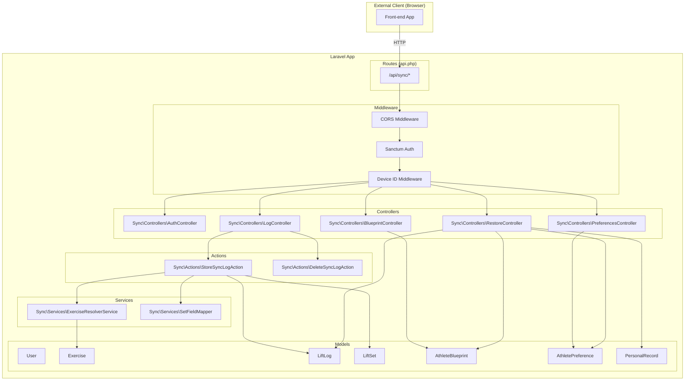

# Design Document: Sync API

## Overview

The Sync API provides a durable storage and restoration layer for an external front-end application. The front-end uses `localStorage` as its source of truth and syncs here via fire-and-forget writes. On cache clear, it restores full state from these endpoints.

The API lives under `/api/sync` on the existing Laravel app, using Sanctum personal access tokens for authentication. It adds 7 endpoints (register, login, store log, delete log, store blueprint, store preferences, restore) and integrates with the existing Exercise, LiftLog, LiftSet, and PersonalRecord models.

Key design principles:
- **Fire-and-forget writes** — the client never waits for responses to proceed
- **Opaque blob storage** — blueprint and preferences are stored verbatim, never interpreted
- **Structured log storage** — completion logs map into the existing `lift_logs` + `lift_sets` schema for PR detection and social features
- **Exercise resolution by name** — the front-end sends display names, the API resolves to Exercise records

## File Map

### New files (created)

```
app/Sync/
├── Controllers/
│   ├── AuthController.php
│   ├── LogController.php
│   ├── BlueprintController.php
│   ├── PreferencesController.php
│   └── RestoreController.php
├── Actions/
│   ├── StoreSyncLogAction.php
│   └── DeleteSyncLogAction.php
├── Services/
│   ├── SetFieldMapper.php
│   └── ExerciseResolverService.php
├── Models/
│   ├── AthleteBlueprint.php
│   └── AthletePreference.php
├── Middleware/
│   ├── EnsureDeviceId.php
│   └── LogSyncRequest.php
└── Commands/
    ├── ReplayFailedRequests.php
    └── PurgeSyncLogs.php

routes/
└── sync.php                          (new route file)

database/migrations/
├── XXXX_create_athlete_blueprints_table.php
├── XXXX_create_athlete_preferences_table.php
├── XXXX_add_sync_columns_to_lift_logs_table.php
├── XXXX_add_sync_columns_to_lift_sets_table.php
└── XXXX_migrate_cardio_distance_data.php

docs/
└── sync-api-operations.md            (operations runbook)

tests/
├── Feature/Sync/
│   └── SyncApiSmokeTest.php
└── Unit/Sync/
    ├── SetFieldMapperTest.php
    ├── ExerciseResolverServiceTest.php
    ├── StoreSyncLogActionTest.php
    └── DeleteSyncLogActionTest.php
```

### Existing files (modified)

```
app/Models/LiftLog.php                (add fillable: track, block_index, movement_index, log_type, device_id, source)
app/Models/LiftSet.php                (add fillable: distance, distance_unit, calories)
app/Models/User.php                   (add HasApiTokens trait for Sanctum)
app/Services/ExerciseTypes/CardioExerciseType.php  (read distance column instead of reps)
app/Services/Charts/CardioProgressionChartGenerator.php  (read distance column)
app/Actions/LiftLogs/CreateLiftLogAction.php       (pass distance/calories to set creation)
app/Actions/LiftLogs/UpdateLiftLogAction.php       (pass distance/calories to set creation)
app/Providers/RouteServiceProvider.php (register routes/sync.php)
config/cors.php                       (add api/sync/* to paths)
config/logging.php                    (add sync_requests channel)
composer.json                         (add laravel/sanctum)
```

## Architecture



### Request Flow

1. Client sends request to `/api/sync/*`
2. CORS middleware allows the request (wildcard origins for pilot)
3. Sanctum middleware authenticates the user (except register/login)
4. Device ID middleware extracts `X-Device-Id` header and makes it available to controllers
5. Controller validates input, delegates to an Action
6. Action performs business logic (exercise resolution, set mapping, log creation)
7. Response returned as JSON with `status` field

## Components and Interfaces

### Controllers

All controllers live in `App\Sync\Controllers\` namespace.

**AuthController**
- `register(Request $request): JsonResponse` — creates user, generates token
- `login(Request $request): JsonResponse` — authenticates, returns token

**LogController**
- `store(Request $request): JsonResponse` — creates a completion log
- `destroy(LiftLog $liftLog): JsonResponse` — soft-deletes a log by ID

**BlueprintController**
- `store(Request $request): JsonResponse` — upserts blueprint JSON

**PreferencesController**
- `store(Request $request): JsonResponse` — upserts preferences JSON

**RestoreController**
- `index(Request $request): JsonResponse` — returns full user state

### Actions

Following the existing Actions pattern (see `CreateLiftLogAction`):

**StoreSyncLogAction** (`App\Sync\Actions\StoreSyncLogAction`)
```php
class StoreSyncLogAction
{
    public function __construct(
        private ExerciseResolverService $exerciseResolver,
        private SetFieldMapper $setFieldMapper,
    ) {}

    public function execute(User $user, array $validated, ?string $deviceId): LiftLog
}
```

Responsibilities:
- Resolve exercise name → Exercise record
- Create new lift_log with all fields
- Create lift_sets using SetFieldMapper
- Dispatch `LiftLogCompleted` event for async PR detection

**DeleteSyncLogAction** (`App\Sync\Actions\DeleteSyncLogAction`)
```php
class DeleteSyncLogAction
{
    public function execute(User $user, LiftLog $liftLog): void
}
```

Responsibilities:
- Verify lift_log belongs to user
- Soft-delete log and associated sets (existing boot logic handles cascading)

### Services

**ExerciseResolverService** (`App\Sync\Services\ExerciseResolverService`)

A new, purpose-built service for the sync API. Simpler than ExerciseMatchingService (no fuzzy scoring) — just a deterministic priority chain:

```php
class ExerciseResolverService
{
    public function resolve(string $exerciseName, User $user, ?string $logType = null): Exercise
}
```

Resolution priority:
1. Exact match on `exercises.canonical_name` using `Str::snake($name)`
2. Case-insensitive match on `exercises.title`
3. Case-insensitive match on `exercise_aliases.alias_name`
4. Auto-create with `title`, `canonical_name = Str::snake($name)`, `exercise_type` derived from `logType`

All lookups scoped to: `WHERE (user_id IS NULL OR user_id = $user->id) AND deleted_at IS NULL`

**SetFieldMapper** (`App\Sync\Services\SetFieldMapper`)

A pure mapping service — no database interaction. Bidirectional: maps incoming set fields to DB columns on store, and reconstructs the original field names from DB columns on restore.

```php
class SetFieldMapper
{
    public function mapToColumns(string $logType, array $setData, string $weightUnit): array

    public function mapFromColumns(string $logType, LiftSet $set): array
}
```

`mapToColumns` returns an array of column values for `lift_sets` based on the log type mapping rules. Always includes `unit` (from the request-level weight_unit).

`mapFromColumns` reconstructs the front-end set shape from structured columns using the log_type as the key (e.g., if log_type is "dual-dumbbell", return `{ weight: $set->weight, reps: $set->reps }`; if "kettlebell", return `{ kbWeight: $set->weight, reps: $set->reps }`).

### Middleware

**EnsureDeviceId** (`App\Sync\Middleware\EnsureDeviceId`)

Extracts the `X-Device-Id` header and binds it to the request attributes so controllers can access it via `$request->attributes->get('device_id')`. Non-blocking — if absent, continues with null.

**LogSyncRequest** (`App\Sync\Middleware\LogSyncRequest`)

Logs every incoming request to the sync API to a dedicated filesystem log before any processing occurs. This is the single durable record of all incoming data — if the backend breaks, these logs contain everything needed to replay.

```php
class LogSyncRequest
{
    public function handle(Request $request, Closure $next)
    {
        // Log BEFORE processing — this is the safety net
        try {
            Log::channel('sync_requests')->info(json_encode([
                'ts' => now()->toIso8601String(),
                'ip' => $request->ip(),
                'method' => $request->method(),
                'path' => $request->path(),
                'query' => $request->query(),
                'headers' => $request->headers->all(),
                'body' => $request->all(),
            ]));
        } catch (\Throwable $e) {
            // Don't block the request
        }

        return $next($request);
    }
}
```

The `sync_requests` log channel is configured in `config/logging.php` as a daily rotating file at `storage/logs/sync/requests.log`.

### CLI Commands

**`sync:replay-failed`** (`App\Sync\Commands\ReplayFailedRequests`)

Parses log entries from `storage/logs/sync/requests.log`, identifies requests to replay (via flags, date range, or manual selection), and re-submits them through the controller logic.

**`sync:purge-logs`** (`App\Sync\Commands\PurgeSyncLogs`)

Deletes log files in `storage/logs/sync/` older than N days (default 30). Supports `--days=N` flag.

### Models

**AthleteBlueprint** (`App\Sync\Models\AthleteBlueprint`)
```php
// fillable: user_id, blueprint_data, device_id
// casts: blueprint_data → array
// relationship: belongsTo(User)
```

**AthletePreference** (`App\Sync\Models\AthletePreference`)
```php
// fillable: user_id, preferences_data, device_id
// casts: preferences_data → array
// relationship: belongsTo(User)
```

Existing models (`LiftLog`, `LiftSet`) gain new fillable fields — no new model classes needed for them.

### Routes

Routes live in a dedicated `routes/sync.php` file, registered via the RouteServiceProvider with prefix `api/sync`:

```php
// routes/sync.php
use App\Sync\Controllers\AuthController;
use App\Sync\Controllers\LogController;
use App\Sync\Controllers\BlueprintController;
use App\Sync\Controllers\PreferencesController;
use App\Sync\Controllers\RestoreController;

Route::post('/register', [AuthController::class, 'register']);
Route::post('/login', [AuthController::class, 'login']);

Route::middleware(['auth:sanctum', 'device-id', 'log-sync-request'])->group(function () {
    Route::post('/logs', [LogController::class, 'store']);
    Route::delete('/logs/{liftLog}', [LogController::class, 'destroy']);
    Route::post('/blueprint', [BlueprintController::class, 'store']);
    Route::post('/preferences', [PreferencesController::class, 'store']);
    Route::get('/restore', [RestoreController::class, 'index']);
});
```

Registered in the RouteServiceProvider (or `bootstrap/app.php`):
```php
Route::prefix('api/sync')->group(base_path('routes/sync.php'));
```

## Data Models

### New Tables

**athlete_blueprints**
| Column | Type | Constraints |
|--------|------|-------------|
| id | BIGINT UNSIGNED | PK, auto-increment |
| user_id | BIGINT UNSIGNED | UNIQUE, FK → users(id) ON DELETE CASCADE |
| blueprint_data | JSON | NOT NULL |
| device_id | VARCHAR(36) | NULLABLE |
| created_at | TIMESTAMP | NULLABLE |
| updated_at | TIMESTAMP | NULLABLE |

**athlete_preferences**
| Column | Type | Constraints |
|--------|------|-------------|
| id | BIGINT UNSIGNED | PK, auto-increment |
| user_id | BIGINT UNSIGNED | UNIQUE, FK → users(id) ON DELETE CASCADE |
| preferences_data | JSON | NOT NULL |
| device_id | VARCHAR(36) | NULLABLE |
| created_at | TIMESTAMP | NULLABLE |
| updated_at | TIMESTAMP | NULLABLE |

### Modified Tables

**lift_logs** — new columns:
| Column | Type | Notes |
|--------|------|-------|
| track | VARCHAR(20) | NULLABLE, optional hint for front-end slot resolution |
| block_index | TINYINT UNSIGNED | NULLABLE, optional hint |
| movement_index | TINYINT UNSIGNED | NULLABLE, optional hint |
| log_type | VARCHAR(30) | NULLABLE |
| device_id | VARCHAR(36) | NULLABLE |
| source | VARCHAR(10) | NULLABLE, 'sync' or null |

No uniqueness constraints on track/block_index/movement_index — multiple logs for the same exercise on the same day are valid.

**lift_sets** — new columns:
| Column | Type | Notes |
|--------|------|-------|
| calories | SMALLINT UNSIGNED | NULLABLE |
| distance | DECIMAL(8,2) | NULLABLE |
| distance_unit | VARCHAR(5) | NULLABLE |

### Set Field Mapping Table

| log_type | weight | reps | time | band_color | calories | distance | distance_unit |
|----------|--------|------|------|------------|----------|----------|---------------|
| barbell | `weight` | `reps` | — | — | — | — | — |
| single-dumbbell | `weight` | `reps` | — | — | — | — | — |
| dual-dumbbell | `weight` | `reps` | — | — | — | — | — |
| bodyweight | `addedWeight` | `reps` | — | — | — | — | — |
| added-weight | `addedWeight` | `reps` | — | — | — | — | — |
| kettlebell | `kbWeight` | `reps` | — | — | — | — | — |
| ball | `ballWeight` | `reps` | — | — | — | — | — |
| bodyweight-reps | — | `reps` | — | — | — | — | — |
| static-hold | — | — | `duration` | — | — | — | — |
| weighted-carry | `weight` | — | `duration` | — | — | — | — |
| dual-kettlebell | `kbWeight` | — | `duration` | — | — | — | — |
| cardio | — | — | `time` | — | `calories` | `distance` | `distanceUnit` |
| cardio-calories | — | — | — | — | `calories` | — | — |
| cardio-distance | — | — | `time` | — | — | `distance` | `distanceUnit` |
| banded | — | `reps` | — | `bandColor` | — | — | — |

All types: `unit` = request-level `weight_unit`. The `log_type` on the lift_log serves as the key for reversing the mapping on restore.

### Exercise Type Derivation

When auto-creating an exercise from `logType`:

| logType | exercise_type |
|---------|---------------|
| barbell, single-dumbbell, dual-dumbbell, kettlebell, dual-kettlebell, ball, weighted-carry | regular |
| bodyweight, bodyweight-reps, added-weight | bodyweight |
| banded | banded_resistance |
| static-hold | static_hold |
| cardio, cardio-calories, cardio-distance | cardio |

## Correctness Properties

*A property is a characteristic or behavior that should hold true across all valid executions of a system — essentially, a formal statement about what the system should do. Properties serve as the bridge between human-readable specifications and machine-verifiable correctness guarantees.*

### Property 1: Registration creates user with generated email and returns token

*For any* valid username (unique, non-empty) and password (≥ 6 characters), calling POST /register should create a User with `email = "{username}@sync.local"` and return a response containing `{ status: "ok", token: <non-empty string>, athlete: <username> }`.

**Validates: Requirements 2.1, 2.2**

### Property 2: Password validation rejects short passwords

*For any* string with length < 6, calling POST /register with that password should return HTTP 422. *For any* string with length ≥ 6 (and a unique username), registration should succeed.

**Validates: Requirements 2.4**

### Property 3: Log store preserves all data with correct field mapping

*For any* valid log payload (exercise_name, date, track, block_index, movement_index, log_type, sets, weight_unit), storing it should produce:
- A `lift_log` with `logged_at = date@12:00:00`, `track`, `block_index`, `movement_index`, `log_type`, `device_id`, `comments = note`
- For each set: a `lift_set` with columns populated per the mapping table for that `log_type` and `unit = weight_unit`

**Validates: Requirements 4.1, 4.5, 4.6, 4.7, 13.1, 13.2, 13.3, 13.4, 13.5, 13.6, 13.7, 13.8, 13.9, 13.10, 13.11, 13.12, 13.13, 13.14**

### Property 4: Store creates a new log each time

*For any* valid log payload posted twice (with different sets), both calls should create separate `lift_log` rows. The second does not replace the first.

**Validates: Requirements 7.8**

### Property 5: Required field validation returns 422

*For any* required field in a valid log payload (exercise_name, date, track, block_index, movement_index, log_type, sets), removing that field should cause the endpoint to return HTTP 422 with `{ status: "error" }`. Similarly for DELETE (date, track, block_index, movement_index).

**Validates: Requirements 4.9, 5.3**

### Property 6: Delete soft-deletes log and associated sets

*For any* existing lift_log identified by its ID and belonging to the authenticated user, calling DELETE should soft-delete that log and all its lift_sets. After deletion, the log and sets should have non-null `deleted_at` timestamps but still exist in the database.

**Validates: Requirements 5.1**

### Property 7: Blueprint storage round-trip

*For any* valid JSON object, storing it as a blueprint and then reading it back (via the database or restore endpoint) should yield byte-for-byte identical data. The API must not interpret, validate, or transform the contents.

**Validates: Requirements 6.1, 6.3**

### Property 8: Preferences storage round-trip

*For any* valid JSON object, storing it as preferences and then reading it back should yield identical data. The API must not interpret, validate, or transform the contents.

**Validates: Requirements 7.1, 7.3**

### Property 9: Restore returns all logs as an array with correct fields

*For any* user with stored logs, the restore endpoint should return all logs as a flat array (both sync-originated and web-UI-originated). Each entry should include: id, exerciseId (canonical_name), exerciseName (title), date, logType, sets, note, and optionally track/blockIndex/movementIndex if stored.

**Validates: Requirements 11.1, 11.2, 11.3, 11.4**

### Property 10: Restore PR history shows only current records

*For any* user with personal records (some current, some superseded), the restore prHistory should contain only records that are not superseded (have no newer record pointing to them via `previous_pr_id`), grouped by exercise `canonical_name`.

**Validates: Requirements 8.5**

### Property 11: Exercise resolution follows priority chain

*For any* exercise name, the resolver should find the exercise matching in this priority order: (1) exact `canonical_name` match on `Str::snake(name)`, (2) case-insensitive `title` match, (3) case-insensitive `alias_name` match. If multiple matches exist at the same priority level, the first result wins. All lookups exclude soft-deleted records and are scoped to global + user-owned.

**Validates: Requirements 9.1, 9.2, 9.3, 9.5, 9.6**

### Property 12: Exercise auto-creation on no match

*For any* exercise name that doesn't match any existing exercise (via canonical_name, title, or alias), the resolver should create a new Exercise with `title = input name`, `canonical_name = Str::snake(input)`, and `exercise_type` derived from the provided `logType`.

**Validates: Requirements 9.4**

### Property 13: Data isolation between users

*For any* two authenticated users, data stored by user A (logs, blueprint, preferences) should never appear in user B's restore response, and vice versa.

**Validates: Requirements 10.3**

### Property 14: Set field mapping is deterministic and complete

*For any* valid `(log_type, set_data)` pair from the supported log type registry, the SetFieldMapper should produce a column array that: (a) maps exactly the fields specified in the mapping table for that log_type, and (b) includes `unit` matching the request-level `weight_unit`. Additionally, `mapFromColumns` should reconstruct the original field names from structured columns using log_type as the key.

**Validates: Requirements 13.1, 13.2, 13.3, 13.4, 13.5, 13.6, 13.7, 13.8, 13.9, 13.10, 13.11, 13.12, 13.13, 13.14**

## Error Handling

### Response Format

All endpoints return JSON with a consistent envelope:

```json
// Success
{ "status": "ok", ...additional_fields }

// Error
{ "status": "error", "message": "Human-readable description" }
```

### Error Categories

| Scenario | HTTP Status | Response |
|----------|-------------|----------|
| Validation failure (missing/invalid fields) | 422 | `{ status: "error", message: "..." }` |
| Auth failure (missing/invalid token) | 401 | `{ status: "error", message: "..." }` |
| Duplicate username on register | 422 | `{ status: "error", message: "The username has already been taken." }` |
| Invalid login credentials | 401 | `{ status: "error", message: "Invalid credentials." }` |
| Unexpected server error | 500 | `{ status: "error", message: "Internal server error" }` |

### Exception Handling Strategy

A custom exception handler (or `render` override in `Handler.php`) ensures:
- `ValidationException` → 422 with first error message
- `AuthenticationException` → 401
- All other exceptions → 500 with generic message (no stack traces, no internal details)

This applies only to routes under `/api/sync` (scoped via route middleware or exception handler logic) to avoid affecting the existing web application's error handling.

### Idempotency

- DELETE /logs/{id} returns 404 if the log doesn't exist or doesn't belong to the user
- POST /blueprint and POST /preferences always succeed (upsert semantics)
- POST /logs always creates a new log (no upsert, no conflict)

## Testing Strategy

All tests run in PHPUnit (the existing test suite). No additional framework needed.

### Unit Tests

Test services and actions in isolation using factories and mocks. No HTTP, no network.

- **SetFieldMapperTest** — one test per log type verifying exact column output for `mapToColumns`, one test per log type verifying correct field reconstruction for `mapFromColumns`
- **ExerciseResolverServiceTest** — test each resolution step (canonical_name match, title match, alias match, auto-create), test scoping (global + user-owned, excludes soft-deleted)
- **StoreSyncLogActionTest** — test log + sets creation, test event dispatch, test exercise resolution integration
- **DeleteSyncLogActionTest** — test soft-delete cascading, test ownership check

### Smoke Tests (2 feature tests)

Use Laravel's in-process test client (`$this->postJson()`, `$this->getJson()`). These simulate HTTP through the kernel — no real server, no network, no risk of hitting production. Combined with `RefreshDatabase`, the production database is never touched.

- **SyncApiSmokeTest::test_full_write_and_restore_cycle** — register → store a log → store blueprint → store preferences → restore → verify everything comes back correctly
- **SyncApiSmokeTest::test_auth_and_error_responses** — verify 401 on missing token, 422 on validation failure, 404 on wrong-user delete

### Test Organization

```
tests/
├── Feature/
│   └── Sync/
│       └── SyncApiSmokeTest.php    (2 tests — full cycle + error responses)
└── Unit/
    └── Sync/
        ├── SetFieldMapperTest.php
        ├── ExerciseResolverServiceTest.php
        ├── StoreSyncLogActionTest.php
        └── DeleteSyncLogActionTest.php
```

### Environment Isolation

- `phpunit.xml` sets `DB_CONNECTION=sqlite` and `DB_DATABASE=:memory:` (or a dedicated test database) — production is never touched
- Laravel's `RefreshDatabase` trait rolls back all changes after each test
- No external HTTP calls — Laravel's test client boots the app in-process


