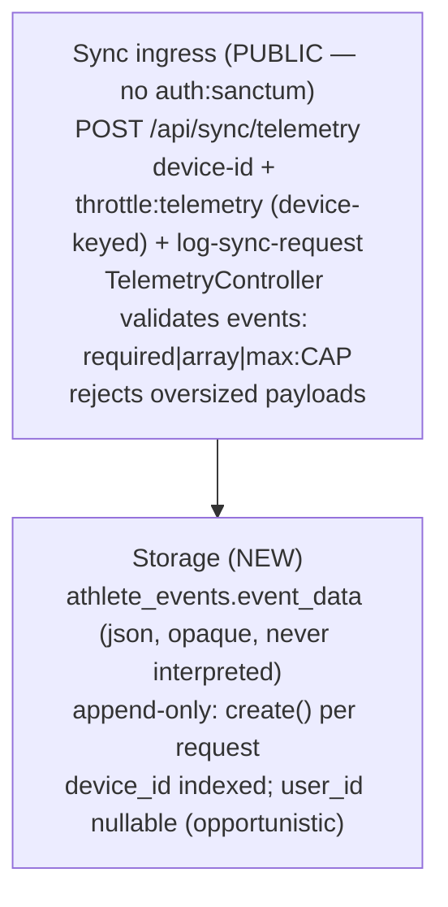

# Anonymous Screen-View Telemetry — Plan (Logger side)

> **Reference architecture, NOT execution steps.** Execute from
> `docs/plans/anonymous-telemetry-prompt.md`. Format per `docs/antigravity-steering.md` §9.
>
> **Cross-repo:** This is the **Logger slice (Slice A)** of the effort owned by the root plan
> `../../docs/plans/anonymous-telemetry-cross-repo.md` (the launch cut of FL-18). Its **FROZEN §1–§8**
> is the authoring source of truth for identity, the endpoint, the table, the limiter, and the wire
> shape. The relevant shapes are DUPLICATED INLINE below (per directional isolation — do not read the
> root doc at execution time). The Athlete slice (Slice B) is INDEPENDENT — no ordering dependency; the
> two meet only at the wire (`POST /telemetry` with `{ device_id, events }`).

---

## Before You Start (read in order)
```
docs/antigravity-steering.md                     → executor contract: git (NEVER commit), Pint BAN, §6 DB rules (nullable + $fillable + cast), §13 Consumer Impact Trace, §15 decomposition, milestones, AGY_COMPLETE
.kiro/steering/safe-operations.md                → files never to edit, bash/artisan safety, Pint ban
.kiro/steering/project-conventions.md            → forward-only migrations, no column repurposing, soft deletes
.kiro/steering/sync-api-context.md               → sync API architecture, app/Sync/ layout, data model
.kiro/steering/laravel-boost.md                  → Eloquent not DB::, constructor promotion, explicit return types, PHPUnit-only, config() not env()
```

---

## What You're Building

A NEW, **PUBLIC (unauthenticated)** telemetry ingest endpoint that stores anonymous screen-view events as
an OPAQUE JSON blob. This is the durable half of the launch telemetry cut; the Athlete app POSTs batches
of `{ screen, ts }` events keyed on its anonymous device id.

Five things:

1. **Migration** — new `athlete_events` table: nullable `user_id` FK (NOT unique), indexed nullable
   `device_id` string(36), opaque `json event_data`, timestamps.
2. **Model** — `AthleteEvent` with `$fillable = ['user_id','device_id','event_data']` and
   `'event_data' => 'array'` in `casts()`.
3. **Route** — `POST /telemetry` in `routes/sync.php`, **OUTSIDE** the `auth:sanctum` group, wearing
   `device-id` + `log-sync-request` + a NEW `throttle:telemetry`.
4. **Controller** — `TelemetryController@store`: append ONE row via `AthleteEvent::create(...)`; read
   `device_id` from request attributes; attach `user_id` ONLY if `$request->user()` resolves; enforce a
   per-request **event-count cap** + **payload-size ceiling**.
5. **Rate limiter** — register `telemetry` in `AppServiceProvider`, keyed on the **device id** (IP only as
   fallback), thresholds in `config/rate_limits.php`.

**`event_data` is OPAQUE (FROZEN §3).** Logger stores it verbatim, NEVER reads inside it, NEVER validates
its inner structure, NEVER derives anything from it — the SAME contract as `blueprint`/`preferences`.
**Telemetry is anonymous (FROZEN §1):** the endpoint is public and is NEVER gated on auth; `user_id` is
opportunistic and nullable.

### Entity Default (FROZEN §3 — mandatory per §15)

```
athlete_events
  id          bigint PK
  user_id     FK users  NULLABLE  NOT unique  cascadeOnDelete
  device_id   string(36) NULLABLE  INDEXED
  event_data  json       (opaque)
  timestamps
AthleteEvent::$fillable = ['user_id','device_id','event_data']
AthleteEvent::casts()  += 'event_data' => 'array'
```
Append-only: every request is a NEW row via `create()` — NEVER `updateOrCreate`. No backfill, no data
migration; the table starts empty.

### FROZEN §2 — the route (PUBLIC)
`Route::post('/telemetry', [TelemetryController::class, 'store'])->middleware(['device-id',
'throttle:telemetry', 'log-sync-request']);` placed OUTSIDE the `auth:sanctum` group in `routes/sync.php`.
Full public path: `POST /api/sync/telemetry`. Precedent for a public sync route with its own limiter:
`Route::post('/auth/check', ...)->middleware('throttle:email-check')` already in this file.

### FROZEN §1 + controller behavior
```
store(Request $request):
  - $deviceId = $request->attributes->get('device_id');       // from EnsureDeviceId (X-Device-Id header)
  - $userId   = $request->user()?->id;                        // opportunistic; null for anonymous
  - validate: 'events' => 'required|array|max:<CAP>',         // per-request event-count cap
              'events.*' => 'array'                            // opaque; NO inner-key rules
  - AthleteEvent::create([
        'user_id'    => $userId,
        'device_id'  => $deviceId,
        'event_data' => ['events' => $validated['events']],    // stored verbatim
    ]);
  - return response()->json(['status' => 'ok']);
```
- **Payload-size ceiling:** reject oversized bodies BEFORE storing (e.g. an early `abort(413)` /
  validation on `count($request->input('events'))` beyond the cap, and/or a max on the JSON size). The
  `api/sync/*` exception handler already shapes 422/429; a size rejection should return the same
  `{status:'error', message:...}` JSON shape.
- **Never interpret `event_data`.** Do NOT read `events.*.screen`, do NOT branch on any inner field.

### FROZEN §4 — rate limiter (device-keyed)
```
// AppServiceProvider::boot()
RateLimiter::for('telemetry', function (Request $request) {
    return $this->buildLimits('telemetry', $request->header('X-Device-Id') ?: $request->ip());
});
// config/rate_limits.php
'telemetry' => [ 'per_minute' => 30, 'per_hour' => null ],
```
Keyed on the **device id**, IP only as fallback — shared gym WiFi would otherwise collapse ~800 members
into ONE IP bucket and drop real data. Thresholds live in `config/rate_limits.php` (single source), NOT
hardcoded.

---

## Diagram L1 — Runtime path (all NEW)


---

## Existing Code to Understand (read before modifying)
```
routes/sync.php                                      → add the PUBLIC /telemetry route OUTSIDE the auth:sanctum group; mirror /auth/check as the public-route precedent
bootstrap/app.php                                    → 'device-id' + 'log-sync-request' aliases; the api/sync/* JSON error contract telemetry inherits
app/Sync/Middleware/EnsureDeviceId.php               → reads X-Device-Id into request attributes (device_id); reuse as-is
app/Sync/Controllers/BlueprintController.php         → reference controller for storing an opaque blob keyed by user + device_id; telemetry mirrors it but uses create() + is anonymous
app/Sync/Models/AthleteBlueprint.php                 → reference model: $fillable + 'x' => 'array' cast; AthleteEvent mirrors it
database/migrations/2026_06_15_000001_create_athlete_blueprints_table.php → reference migration; telemetry drops the ->unique() on user_id and adds a device_id index
app/Providers/AppServiceProvider.php                 → RateLimiter::for(...) registrations + buildLimits(); add 'telemetry' keyed on X-Device-Id
config/rate_limits.php                               → named-limiter thresholds; add 'telemetry'
```

## Key facts (do not re-discover)
1. Sync routes live in `routes/sync.php` under the `api/sync` prefix (registered in `bootstrap/app.php`),
   NOT `routes/api.php`. Public path is `/api/sync/telemetry`.
2. `EnsureDeviceId` already extracts `X-Device-Id` → request attribute `device_id`. Reuse it; do NOT write
   a new middleware.
3. `event_data` is OPAQUE (`blueprint`/`preferences` precedent) — store/return verbatim; validate only
   `events` as `required|array|max:CAP` and `events.*` as `array`. No inner-key rules.
4. The endpoint is PUBLIC — `$request->user()` MAY be null. `user_id` nullable + opportunistic. Never
   `auth:sanctum`, never an `isAuthenticated`-equivalent guard.
5. Limiter keyed on device id, IP fallback — NOT primary IP (shared WiFi). Thresholds in config only.
6. Append-only: `create()`, never `updateOrCreate`. No slot/identity key.

---

## Execution Plan (decomposed per `docs/antigravity-steering.md` §15)
Checkpoints use `php artisan test --parallel`.

### Phase 1 — Migration + model + unit test, then RUN the migration
- `php artisan make:migration create_athlete_events_table --no-interaction`. In `up()`:
  `Schema::create('athlete_events', function (Blueprint $t) { $t->id();
   $t->foreignId('user_id')->nullable()->constrained()->cascadeOnDelete();
   $t->string('device_id', 36)->nullable()->index(); $t->json('event_data'); $t->timestamps(); });`
  `down()`: `Schema::dropIfExists('athlete_events');`
- `AthleteEvent` model: `$fillable = ['user_id','device_id','event_data']`; `casts()` returns
  `['event_data' => 'array']`; `user()` BelongsTo (mirror `AthleteBlueprint`).
- Unit test: an `AthleteEvent` created with `event_data => ['events' => [['screen'=>'welcome','ts'=>'...']]]`
  round-trips through the cast as an array; `user_id => null` is allowed.
- **RUN it:** `php artisan migrate` then `php artisan migrate:status` — confirm the new migration shows
  **Ran** (per `docs/antigravity-steering.md` §8).
- **Checkpoint.**

### Phase 2 — Rate limiter + config
- `config/rate_limits.php`: add `'telemetry' => ['per_minute' => 30, 'per_hour' => null]` with a comment
  noting it is keyed on the device id (shared-WiFi rationale).
- `AppServiceProvider::boot()`: `RateLimiter::for('telemetry', fn (Request $r) =>
  $this->buildLimits('telemetry', $r->header('X-Device-Id') ?: $r->ip()));`
- **Checkpoint** (registration doesn't need a dedicated test; covered by the feature test in Phase 3).

### Phase 3 — Controller + route + feature test
- `TelemetryController@store` (in `app/Sync/Controllers/`): validate `events => required|array|max:CAP`
  and `events.* => array`; read `device_id` from `$request->attributes->get('device_id')`; `user_id` from
  `$request->user()?->id`; `AthleteEvent::create([...])` with `event_data => ['events' => $validated['events']]`;
  return `{status:'ok'}`. Reject over-cap / oversized payloads with a 422 (or 413) in the standard JSON
  shape.
- `routes/sync.php`: add the PUBLIC route OUTSIDE the `auth:sanctum` group with
  `['device-id','throttle:telemetry','log-sync-request']`.
- Feature tests (`tests/Feature/Sync/...`):
  - **Anonymous POST** (NO token) with a small `events` array + `X-Device-Id` header → 200 `{status:ok}`;
    one `athlete_events` row exists with `user_id = null`, the given `device_id`, and `event_data.events`
    deep-equal to the payload.
  - **Authenticated POST** (with a Sanctum token) → row has `user_id` set to that user; still stores
    verbatim.
  - **Append-only:** two POSTs from the same device → TWO rows (not an upsert).
  - **Over-cap** `events` array (length > CAP) → rejected (422/413), NO row written.
  - CONFIRM the endpoint does NOT require auth (the anonymous test proves it).
- **Checkpoint.**

### Phase 4 — Verification + cleanup sweep
- Full suite green (`php artisan test --parallel`). §"End-of-Run Cleanup Sweep": no unused `use`, no dead
  branch, no `event_data` interpretation anywhere, no `auth:sanctum` accidentally on the route, delete
  `.test-output.txt`.

---

## Consumer Impact Trace (mandatory — `docs/antigravity-steering.md` §13)
| Structure changed | Reads / interprets it | Action |
|---|---|---|
| NEW `athlete_events` table | Eloquent (`AthleteEvent`) | New model: `$fillable` + `'event_data' => 'array'` cast; nullable `user_id`, indexed `device_id`. |
| NEW `TelemetryController@store` | the new route | Append via `create()`; `device_id` from attrs; opportunistic `user_id`; cap + size guard; never interpret blob. |
| NEW public route in `routes/sync.php` | HTTP clients (Athlete) | Placed OUTSIDE `auth:sanctum`; `device-id` + `throttle:telemetry` + `log-sync-request`. |
| NEW `telemetry` limiter | `throttle:telemetry` middleware | Registered in `AppServiceProvider`, keyed on `X-Device-Id` (IP fallback); thresholds in `config/rate_limits.php`. |
| `config/rate_limits.php` | `buildLimits('telemetry', ...)` | Add the `telemetry` entry. |
| Existing auth'd sync endpoints | — | UNCHANGED — telemetry is additive; no existing route/table touched. |

**Tests to add:** `AthleteEvent` cast round-trip (+ nullable user_id); feature tests (anonymous 200 +
row/user_id null; authenticated → user_id set; append-only two-rows; over-cap rejected). **No existing
test covers telemetry — it is entirely new.**

## Simplicity Criteria
- ONE new table, ONE new model, ONE new controller action, ONE new route, ONE new limiter. `event_data`
  stored verbatim; no interpretation, no strategy, no slot key, no data migration, no change to any
  existing endpoint.

## Hard Rules
- **NEVER commit/push. NEVER Pint. NEVER destructive DB** (`migrate:fresh`/`reset`/`db:wipe`). Never modify
  a run migration.
- Do NOT put `auth:sanctum` on the route or add any auth guard — telemetry is anonymous.
- Do NOT interpret `event_data`, validate its inner structure, or derive anything from it — opaque blob.
- Do NOT key the `telemetry` limiter primarily on IP — device id primary, IP fallback (shared WiFi).
- Do NOT use `updateOrCreate` — append-only `create()`.
- Do NOT add a data migration/backfill; the table starts empty.
- Do NOT make `user_id` unique or required — it is nullable + opportunistic.

## Implementation Rules
- Eloquent not `DB::`. Constructor promotion; explicit return types. PHPUnit only; factories.
  `--no-interaction`. New column set nullable-where-noted + `$fillable` + cast (§6). Mirror
  `BlueprintController`/`AthleteBlueprint`/`create_athlete_blueprints_table` (dropping `->unique()`, adding
  the `device_id` index). All code in `app/Sync/` + `database/migrations/` + `routes/sync.php` +
  `config/` + `AppServiceProvider`.

## Success Criteria
- [ ] `athlete_events` exists (nullable non-unique `user_id` FK cascadeOnDelete, indexed nullable
      `device_id` string(36), `json event_data`, timestamps); migration RUN (`migrate:status` = Ran); no
      backfill.
- [ ] `AthleteEvent` fills the three columns + casts `event_data` to `array`; `user_id` nullable.
- [ ] `POST /api/sync/telemetry` is PUBLIC (no `auth:sanctum`), appends one row per request via `create()`,
      reads `device_id` from `X-Device-Id`, sets `user_id` only when a token resolves.
- [ ] Per-request event-count cap + payload-size ceiling reject oversized bodies in the standard JSON
      error shape; no row written on rejection.
- [ ] `telemetry` limiter registered, keyed on device id (IP fallback), thresholds in
      `config/rate_limits.php`.
- [ ] `event_data` never interpreted; endpoint never gated on auth.
- [ ] `php artisan test --parallel` green; cleanup sweep clean; no existing endpoint touched; no deps; no
      commits.

## Do Not
- Do NOT gate on auth / add `auth:sanctum` / read a token as a requirement.
- Do NOT interpret/validate-inner/derive-from `event_data`.
- Do NOT key the limiter primarily on IP. Do NOT `updateOrCreate`. Do NOT make `user_id` unique/required.
- Do NOT backfill or add a data migration. Do NOT edit historical migrations or any `contracts/` file.
- Do NOT commit/push, run Pint, or run destructive DB commands.

## Post-Execution Retro (authored by the REVIEWER, not the executor — leave placeholders)
- **Attempts:** {1 (clean) / N + root cause}
- **Tests added:** {count}
- **Prompt improvements for next time:** {…}
- **Steering updates needed:** {yes/no + what}
