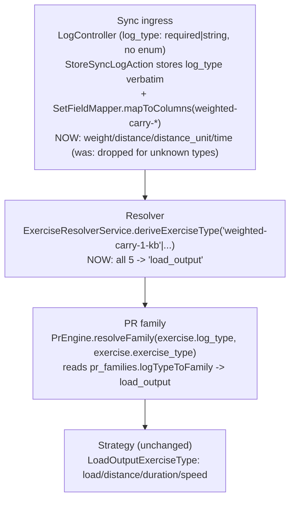
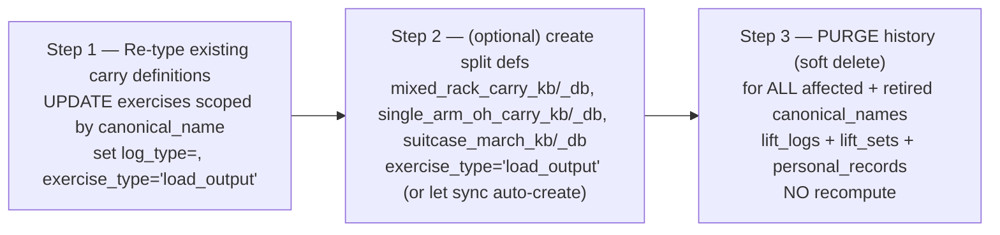

# Carry LogType System — Plan (Logger side)

> **Reference architecture, NOT execution steps.** Execute from `docs/plans/carry-logtype-system-prompt.md`.
> Format per `docs/antigravity-steering.md` §9.
>
> **Cross-repo:** This is the **Logger slice (Slice A)** of the effort owned by the root plan
> `../../docs/plans/carry-logtype-system-cross-repo.md`. Its **FROZEN §1–§5** is the source of truth for
> all shared names, the exercise assignment, and the purge decision. Do NOT re-decide them here. Logger
> runs FIRST; contracts LAST. This REUSES the existing `load_output` family/type/PR-enum — **no new
> `pr_type` strings, no enum migration.**

---

## Before You Start (read in order)
```
docs/antigravity-steering.md                     → executor contract: git (NEVER commit), Pint BAN, DB rules, milestones, §13 trace, §15 decomposition, AGY_COMPLETE
.kiro/steering/project-conventions.md            → forward-only migrations, no column repurposing, dispatch events, soft deletes
.kiro/steering/sync-api-context.md               → exercise-type strategy pattern, PR dispatch, data model
.kiro/steering/laravel-boost.md                  → Eloquent not DB::, constructor promotion, explicit return types, PHPUnit-only
```
Cross-repo source of truth (read, do not edit): `../../docs/plans/carry-logtype-system-cross-repo.md`
(FROZEN §1–§5). Prior art (read, do not edit): `docs/plans/completed/sled-carry-load-output.md`.

---

## What You're Building

Route **five new carry logTypes** into the existing `load_output` exercise type / PR family, so every
carry exercise syncs, persists, and computes PRs identically on Logger — and PURGE the (unmigratable)
historical carry data as part of the same Laravel migration.

**FROZEN §1 — the five logTypes, all → `load_output`:**

| logType | Implement | Load column source |
|---------|-----------|--------------------|
| `weighted-carry-1-kb` | 1 kettlebell | `kbWeight`→`weight` |
| `weighted-carry-2-kb` | 2 kettlebells | `kbWeight`→`weight` |
| `weighted-carry-1-db` | 1 dumbbell | `weight` |
| `weighted-carry-2-db` | 2 dumbbells | `weight` |
| `weighted-carry-ball` | 1 slam/med ball | `ballWeight`→`weight` |

Logger stores a uniform `weight` column regardless of implement (Athlete owns the rename/kg-snap on
download), so all five map identically at the column level: `weight` + `distance` + `distance_unit` +
`time`. The implement distinction is an Athlete-side picker concern; on Logger they are five logType
strings that all derive `load_output` and all persist the same columns.

**Scope: NO new `pr_type` strings, NO `personal_records.pr_type` enum change.** The `load` / `distance` /
`duration` / `speed` records already exist (sled/carry effort). This slice is a logType→family routing
change + set-field mapping + a data migration (re-type + create split exercises + purge history). Zero
behavioral change to `static_hold`, existing `load_output` members (sled), or any other type.

**`dual-kettlebell` is removed** from the active vocabulary (`logTypeToFamily`, `deriveExerciseType`,
`SetFieldMapper`); it survives only in historical migration files (never edited).

### FROZEN §4 — exercise assignment + the three splits

| logType | canonical_name(s) |
|---------|-------------------|
| `weighted-carry-2-kb` | `farmers_carry`, `farmers_carry_march`, `two_kb_front_rack_carry`, `kb_rack_carry`, `mixed_rack_carry_kb` (new) |
| `weighted-carry-1-kb` | `sa_farmers_carry`, `kb_horns_up_march`, `bottoms_up_kb_carry`, `filly_kb_carry`, `kb_overhead_carry`, `kb_bottoms_up_hold_walk`, `single_arm_oh_carry_kb` (new), `suitcase_march_kb` (new) |
| `weighted-carry-2-db` | `mixed_rack_carry_db` (new) |
| `weighted-carry-1-db` | `single_arm_oh_carry_db` (new), `suitcase_march_db` (new) |
| `weighted-carry-ball` | `bearhug_carry`, `bear_hug_march` |

**Splits** (original id retired + history purged; two new ids created):
`mixed_rack_carry` → `mixed_rack_carry_kb` + `mixed_rack_carry_db`; `single_arm_oh_carry` →
`single_arm_oh_carry_kb` + `single_arm_oh_carry_db`; `suitcase_march` → `suitcase_march_kb` +
`suitcase_march_db`. **Untouched (stay `static_hold`):** `bearhug_hold`, `kb_farmers_hold`,
`kb_bottoms_up_hold`.

> **Logger split note:** Logger auto-creates exercises by NAME on sync, so the two new split ids will be
> created organically when Athlete first syncs them. The migration only needs to CREATE them proactively
> if you want their definitions to exist server-side before first sync (recommended for the re-type +
> purge to be self-contained). Since there is no history worth keeping for the original split ids, the
> migration RE-TYPES nothing for them — it purges the original id's history and (optionally) seeds the two
> new definitions. Confirm the exact create-vs-let-sync choice in the prompt; either is acceptable as long
> as no old history survives under the retired id.

---

## Diagram L1 — Runtime path (what changes)


## Diagram L2 — Migration sequence (strict order; one-time)

> **No enum step** — `load` / `distance` / `duration` / `speed` already exist in `personal_records.pr_type`.

---

## Existing Code to Understand (read before modifying)
```
config/pr_families.php                                → logTypeToFamily map + load_output family block. ADD 5 keys → 'load_output'; REMOVE 'dual-kettlebell'.
app/Services/PR/PrEngine.php                          → resolveFamily() reads the map. NO change.
app/Sync/Services/ExerciseResolverService.php         → deriveExerciseType() match; resolve() matches by name, never overwrites non-null log_type. ADD 5 → 'load_output'; REMOVE 'dual-kettlebell'.
app/Sync/Services/SetFieldMapper.php                  → mapToColumns()/mapFromColumns() switch($logType), no default. ADD one shared arm for all 5 (weight from kbWeight??ballWeight??weight; distance; distance_unit; time from duration).
app/Services/ExerciseTypes/LoadOutputExerciseType.php → the strategy the 5 logTypes reuse UNCHANGED.
app/Sync/Actions/StoreSyncLogAction.php               → stores log_type + columns verbatim. UNCHANGED.
app/Models/{LiftLog,LiftSet,PersonalRecord}.php       → all use SoftDeletes — the purge is soft-delete.
```
Migration precedents (read; do NOT edit):
```
2026_06_22_150458_fix_weighted_carry_and_dual_kettlebell_exercise_type.php → scoped re-type by log_type
2026_07_25_013942_update_sled_exercises_type_and_log_type.php              → update exercises + dependent lift_logs.log_type
2026_08_10_000605_backfill_exercise_log_types_from_athlete_library.php     → the carries' current dual-kettlebell typing
```

## Key facts (do not re-discover)
1. `exercises.exercise_type` / `.log_type` and `lift_logs.log_type` are plain string columns (no DB enum)
   → no schema migration for the new logType strings or `load_output`.
2. `personal_records.pr_type` IS an enum but already has `load`/`distance`/`duration`/`speed` → **no enum
   migration this slice.**
3. `deriveExerciseType()` runs on auto-create; `resolve()` never overwrites a non-null `log_type` →
   existing carry definitions need the data migration to move them.
4. `LiftLog`/`LiftSet`/`PersonalRecord` use `SoftDeletes` → the purge is a recoverable soft-delete.
5. Logger auto-creates exercises by name on sync → split ids can be created by the migration or organically.

---

## Execution Plan (decomposed per `docs/antigravity-steering.md` §15)
Checkpoints use `php artisan test --parallel`.

### Phase 1 — Family map + resolver + SetFieldMapper + unit tests
- `config/pr_families.php` `logTypeToFamily`: add all 5 logTypes → `'load_output'`; remove
  `'dual-kettlebell'`.
- `ExerciseResolverService::deriveExerciseType()`: add all 5 to the `=> 'load_output'` arm; remove
  `'dual-kettlebell'` (keep `'static-hold'` → `static_hold`).
- `SetFieldMapper::mapToColumns()`: ONE shared arm
  `case 'weighted-carry-1-kb': case 'weighted-carry-2-kb': case 'weighted-carry-1-db':
  case 'weighted-carry-2-db': case 'weighted-carry-ball':` →
  `weight = $setData['kbWeight'] ?? $setData['ballWeight'] ?? $setData['weight'] ?? null;
  distance = $setData['distance'] ?? null; distance_unit = $setData['distanceUnit'] ?? $setData['distance_unit'] ?? null;
  time = $setData['duration'] ?? null;`
- `SetFieldMapper::mapFromColumns()`: the same shared arm → `['weight'=>$set->weight,
  'distance'=>$set->distance, 'distance_unit'=>$set->distance_unit, 'duration'=>$set->time]`.
- Unit tests: each of the 5 logTypes → `load_output` in `deriveExerciseType` + `PrEngine::resolveFamily`;
  `mapToColumns`/`mapFromColumns` round-trip for a KB (kbWeight), DB (weight), and ball (ballWeight) input.
- **Consumer trace — update tests asserting the old shape** (§Consumer Impact Trace):
  `tests/Unit/Sync/SetFieldMapperTest.php`, `tests/Unit/Sync/ExerciseResolverServiceTest.php`,
  `tests/Feature/LoadOutputIntegrationTest.php` (all reference `dual-kettlebell`).
- **Checkpoint.**

### Phase 2 — Sync feature tests (accept + persist + PR + restore)
- Feature tests: POST `/api/squirby/logs` for one logType per implement (`-2-kb` w/ kbWeight+distance+
  duration; `-1-db` w/ weight+distance; `-ball` w/ ballWeight+duration) on new exercises → each
  auto-creates as `load_output`, persists the columns, and records `load_output` PRs (`is_pr`, `pr_count`).
- Feature test: `GET /restore` returns generic `weight`+`distance`+`distance_unit`+`duration` for the new
  logTypes.
- **Checkpoint.**

### Phase 3 — Data migration: re-type + create splits + PURGE history (§5)
One migration. Strict order in `up()`:
1. **Re-type** existing carry definitions scoped by `canonical_name` (FROZEN §4 non-split rows): set
   `log_type` = the new string, `exercise_type='load_output'`; update dependent `lift_logs.log_type` per
   the `2026_07_25_013942` precedent.
2. **Create** the six split definitions (`mixed_rack_carry_kb`/`_db`, `single_arm_oh_carry_kb`/`_db`,
   `suitcase_march_kb`/`_db`) with `exercise_type='load_output'` + the new `log_type` — OR document that
   sync auto-creates them (choose one in the prompt; either is fine as long as no old history survives
   under the retired originals).
3. **PURGE (soft-delete)** all `lift_logs` + `lift_sets` + `personal_records` for every affected +
   retired `canonical_name` (all §4 rows + the three original split ids `mixed_rack_carry`,
   `single_arm_oh_carry`, `suitcase_march`). Soft-delete only (SoftDeletes). NO PR recompute.
- Scope strictly by `canonical_name`. Genuine static-holds untouched.
- `down()`: restore `exercise_type`/`log_type` for re-typed rows, restore (un-soft-delete) the purged rows
  where reversible; document that this is a best-effort down (soft-deletes are restorable; created split
  defs are removed). Never destructive.
- **Checkpoint**, then RUN it: `php artisan migrate --no-interaction` + `php artisan migrate:status` =
  **Ran** (root spine Operating Rule).

### Phase 4 — Grep gate + full verification + cleanup sweep
- Grep `dual-kettlebell` across `app/` + `config/`: only historical migration files + updated tests may
  reference it; ZERO in `pr_families.php`/`ExerciseResolverService`/`SetFieldMapper`.
- Full suite green; §14 cleanup sweep clean (no dead arm, no unused imports, no shims, delete
  `.test-output.txt`).

---

## Consumer Impact Trace (mandatory — `docs/antigravity-steering.md` §13)
| Structure changed | Reads / interprets it | Action |
|---|---|---|
| `logTypeToFamily` +5, −`dual-kettlebell` | `PrEngine::resolveFamily`; root parity fixture | Add 5 → load_output; remove dual-kettlebell. Contract slice C updates the fixture (not from this repo). |
| `deriveExerciseType()` +5, −`dual-kettlebell` | `ExerciseResolverService::resolve()` on auto-create | Add 5 → load_output; drop dual-kettlebell. Existing defs moved by the Phase-3 migration. |
| `SetFieldMapper` +5-logType shared arm | `StoreSyncLogAction` (write); `RestoreController`/`ChangesController` (read) | Add the shared arm; without it the new logTypes' set fields are dropped (the core bug). |
| Re-typed + created carry `exercises` (+ dependent `lift_logs`) | Web UI exercise pages/charts, mobile summary, progression; their PRs | After purge there are no PRs/logs; verify a re-typed carry renders empty-but-valid via LoadOutputExerciseType. |
| PURGED `lift_logs`/`lift_sets`/`personal_records` (soft-delete) | Anything querying those rows (feed, PR tables, charts) | Soft-deleted → excluded by default scopes. Verify feed/PR views for the affected exercises show no stale rows. |
| `LoadOutputExerciseType`, `PrEngine`, `StoreSyncLogAction` | — | UNCHANGED. |

**Tests asserting the OLD shape (update — verified 2026-09-04):**
`tests/Unit/Sync/SetFieldMapperTest.php` (dual-kettlebell case), `tests/Unit/Sync/ExerciseResolverServiceTest.php`
(dual-kettlebell→static_hold), `tests/Feature/LoadOutputIntegrationTest.php` (Dual KB Clean),
`tests/Feature/Sync/SledCarryMigrationVerificationTest.php` (extend: add a KB/DB/ball carry → load_output +
a genuine static hold untouched + purged history assertion).

## Simplicity Criteria
- **ONE shared `SetFieldMapper` arm** for all 5 logTypes (they map identically at the column level), not 5
  blocks. Net map churn: +5/−1 keys in `logTypeToFamily` + `deriveExerciseType`.
- No new family, strategy, PR-type string, or enum. Migration is data-only, scoped by `canonical_name`,
  soft-delete purge with no recompute.

## Hard Rules
- **NEVER commit/push. NEVER Pint. NEVER destructive DB** (`migrate:fresh`/`reset`/`db:wipe`). **Never
  modify a run migration.** Purge is SOFT-delete only.
- The Phase-3 migration is not "done" until it has RUN and `migrate:status` = Ran.

## Implementation Rules
- Eloquent not `DB::` (except migration raw statements). Constructor promotion; explicit return types.
  PHPUnit only; factories. `--no-interaction`. No conversion at ingress (mapper stays verbatim + stamp).

## Success Criteria
- [ ] All 5 logTypes → `load_output` in `logTypeToFamily` + `deriveExerciseType`; `dual-kettlebell` removed.
- [ ] One shared `SetFieldMapper` arm persists + round-trips weight/distance/distance_unit/time for all 5.
- [ ] Migration re-types carry defs, creates the 6 split defs (or documents auto-create), soft-deletes all
      affected + retired history; genuine static-holds untouched; migration RAN.
- [ ] No new `pr_type` values; `LoadOutputExerciseType` unchanged.
- [ ] `php artisan test --parallel` green; grep gate + cleanup sweep clean. No Pint/commits/deps.

## Do Not
- Do NOT add `pr_type` strings or touch the enum. Do NOT recompute PRs (history is purged).
- Do NOT hard-delete — soft-delete only. Do NOT change `static_hold` or move the three pure holds.
- Do NOT re-type by `exercise_type` alone — scope by `canonical_name`.
- Do NOT edit historical migrations or any `contracts/` file.

## Post-Execution Retro (filled after completion; then move plan+prompt to `completed/`)
- **Attempts:** {1 (clean) / N + root cause}
- **Tests added:** {count}
- **Prompt improvements for next time:** {…}
- **Steering updates needed:** {yes/no + what}
