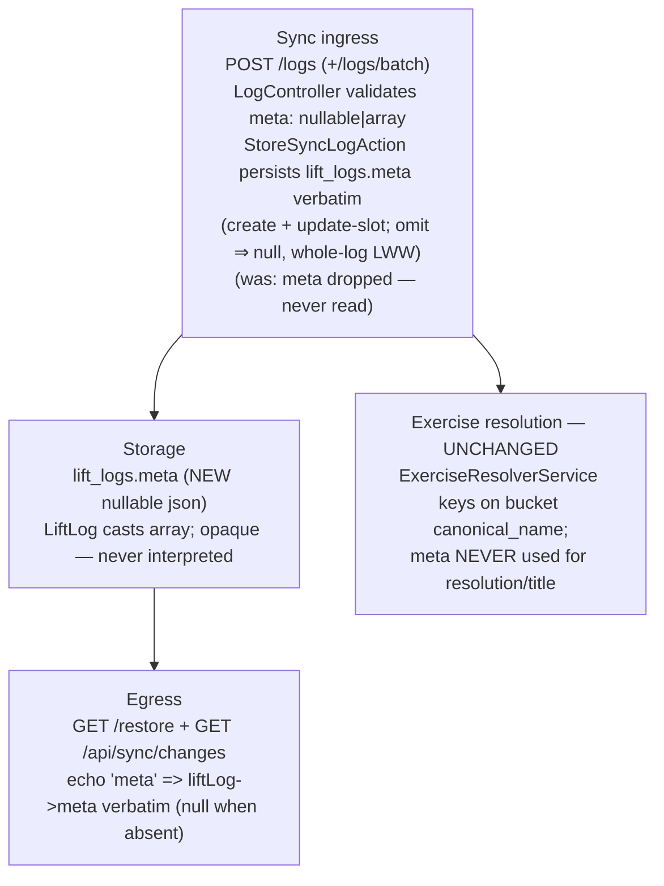

# Olympic-Complex `meta` Persistence — Plan (Logger side)

> **Reference architecture, NOT execution steps.** Execute from
> `docs/plans/olympic-complex-meta-persistence-prompt.md`. Format per `docs/antigravity-steering.md` §9.
>
> **Cross-repo:** This is the **Logger slice (Slice A)** of the effort owned by the root plan
> `../../docs/plans/olympic-complex-meta-persistence-cross-repo.md`. Its **FROZEN §1–§6** is the source of
> truth for the `meta` shape, storage, validation, persistence, and echo. Do NOT re-decide them here.
> Logger runs FIRST; the root contracts slice runs LAST. This adds a NEW nullable `json` column and its
> read/write plumbing — no data migration, no behavioral change to any existing type.

---

## Before You Start (read in order)
```
docs/antigravity-steering.md                     → executor contract: git (NEVER commit), Pint BAN, §6 DB rules (nullable + $fillable + cast), §13 Consumer Impact Trace, §15 decomposition + Entity Defaults, milestones, AGY_COMPLETE
.kiro/steering/project-conventions.md            → forward-only migrations, no column repurposing, one-source-of-truth, soft deletes
.kiro/steering/sync-api-context.md               → sync API architecture, app/Sync/ layout, data model
.kiro/steering/laravel-boost.md                  → Eloquent not DB::, constructor promotion, explicit return types, PHPUnit-only, config() not env()
```
Cross-repo source of truth (read, do not edit): `../../docs/plans/olympic-complex-meta-persistence-cross-repo.md`
(FROZEN §1–§6). Athlete context (read, do not edit): `../../athlete/docs/plans/olympic-complex-single-log-unit.md`
(why `meta` exists + the bucket routing).

---

## What You're Building

Make Logger **persist and echo** the athlete's opaque, versioned per-log `meta` JSON blob so complex
composition identity survives cross-device sync and server restore. Today a POSTed `meta` is silently
dropped (`StoreSyncLogAction` never reads it; `lift_logs` has no `meta` column). Five things:

1. **Migration** — add a NULLABLE `json` column `lift_logs.meta` (no default, no backfill).
2. **Model** — `LiftLog` gets `meta` in `$fillable` and `'meta' => 'array'` in `casts()`.
3. **Validation** — the sync log request(s) validate `meta` as `nullable|array` (opaque object; NO inner
   rules).
4. **Persist** — `StoreSyncLogAction` writes `meta` verbatim in BOTH the create AND update-slot branches
   (and thus the batch path), with **whole-log LWW** (an omitting write nulls a prior `meta`).
5. **Echo** — `RestoreController` and `ChangesController` include `meta` verbatim on each returned log.

**`meta` is OPAQUE (FROZEN §1).** Logger stores and returns it byte-identical, NEVER reads inside it, NEVER
validates its structure, NEVER derives anything from it, and NEVER uses it for exercise resolution — the
SAME contract as `blueprint`/`preferences`. The composition id inside `meta` (`clean_complex_1`) is an
athlete-library id meaningless to Logger; a complex already resolves/pools under its **bucket**
`canonical_name` (`clean_complex`) — that behavior is UNCHANGED.

### Entity Default (FROZEN §2 — mandatory per §15)

```
lift_logs.meta   json   NULLABLE   no default
LiftLog::$fillable  += 'meta'
LiftLog::casts()    += 'meta' => 'array'
```
Stored value for a complex log: `{"v":1,"complex":{"id":"clean_complex_1"}}`. Stored value for every
existing row and every non-complex log: `null`.

### FROZEN §3 — validation
`meta => 'nullable|array'` on the sync log endpoint(s). No `meta.v` / `meta.complex.*` rules — opaqueness.
Match the sibling rules already in `LogController` (single + batch: `logs.*.meta => 'nullable|array'`).

### FROZEN §3 — persistence (whole-log LWW, NO field-merge)
- **Create branch:** `LiftLog::create([... 'meta' => $validated['meta'] ?? null])`.
- **Update-existing-slot branch:** `$existingBySlot->update([... 'meta' => $validated['meta'] ?? null])`.
- **Omit ⇒ null:** an update whose payload omits `meta` overwrites a previously-stored `meta` with `null`.
  This is DELIBERATE — the athlete rides `meta` on the whole log via last-write-wins and "must not assume
  field-level merge" (athlete plan Risks: "Old-client clobber … `meta` rides whole-log via LWW"). Do NOT
  add a `?? $existingBySlot->meta` preserve-shim — that is a fallback (dead-code by construction, §10) and
  it would contradict the frozen LWW agreement.

### FROZEN §4 — echo (verbatim)
- `RestoreController`: add `'meta' => $liftLog->meta` to the `$logData` payload (the cast returns the array
  or `null`).
- `ChangesController`: add `'meta' => $liftLog->meta` to its `$logData` payload identically.
- Wire field name is **`meta`** (matches the athlete's `buildLogPayload` outbound key + `mapServerLog`
  inbound read). Do not rename. (Restore/changes today OMIT null-ish optional keys like `track` only when
  set — for `meta`, always include the key so the athlete's inbound read is uniform; `null` is a valid,
  expected value.)

---

## Diagram L1 — Runtime path (what changes)


---

## Existing Code to Understand (read before modifying)
```
database/migrations/2026_06_15_000003_add_sync_columns_to_lift_logs_table.php → the additive-column pattern to mirror (Schema::table + nullable)
app/Models/LiftLog.php                               → $fillable + casts(); add 'meta' to both
app/Sync/Controllers/LogController.php               → validation for /logs (single) AND /logs/batch (logs.*). Add meta rule to both.
app/Sync/Actions/StoreSyncLogAction.php              → create + update-existing-slot branches. Add 'meta' to both LiftLog writes.
app/Sync/Controllers/RestoreController.php           → builds $logData per log; add 'meta'.
app/Sync/Controllers/ChangesController.php           → builds $logData per log; add 'meta' (same shape).
app/Sync/Services/ExerciseResolverService.php        → CONFIRM unchanged: meta is NOT used for resolution/title.
```

## Key facts (do not re-discover)
1. `meta` is per-log → `lift_logs`, NOT `lift_sets`. It is optional/nullable; existing rows get `null`.
2. `meta` is OPAQUE (`blueprint`/`preferences` precedent) → store/return verbatim; `nullable|array` only.
3. The upsert slot key `(user_id, exercise_id, logged_at date, track, block_index, movement_index)` is
   UNCHANGED — `meta` never participates in identity.
4. `/logs/batch` routes each log through the same `StoreSyncLogAction`, so persisting in the action covers
   batch — but the batch validation array (`logs.*`) needs the `meta` rule too.
5. A complex logs under its bucket (`canonical_name = clean_complex`) → auto-create/pooling UNCHANGED. `meta`
   must never leak into `canonical_name`/`title`/exercise creation.

---

## Execution Plan (decomposed per `docs/antigravity-steering.md` §15)
Checkpoints use `php artisan test --parallel`.

### Phase 1 — Migration + model + unit test, then RUN the migration
- `php artisan make:migration add_meta_to_lift_logs_table --no-interaction`. In `up()`:
  `Schema::table('lift_logs', fn (Blueprint $t) => $t->json('meta')->nullable()->after('movement_index'));`
  `down()`: `dropColumn('meta')`.
- `LiftLog`: add `'meta'` to `$fillable`; add `'meta' => 'array'` to `casts()`.
- Unit test (`LiftLogTest` or a focused model test): a `LiftLog` created with
  `meta => ['v'=>1,'complex'=>['id'=>'clean_complex_1']]` round-trips through the cast as an array;
  `meta => null` stays null.
- **RUN it:** `php artisan migrate` then `php artisan migrate:status` — confirm the new migration shows
  **Ran** (per `docs/antigravity-steering.md` §8; the root contract slice depends on this).
- **Checkpoint.**

### Phase 2 — Ingress: validate + persist (create + update-slot + batch)
- `LogController`: add `'meta' => 'nullable|array'` to the single-log rules AND
  `'logs.*.meta' => 'nullable|array'` to the batch rules.
- `StoreSyncLogAction::execute`: add `'meta' => $validated['meta'] ?? null` to the `LiftLog::create([...])`
  AND to the `$existingBySlot->update([...])` arrays. NO preserve-shim (whole-log LWW; omit ⇒ null).
- Unit/feature test (`StoreSyncLogActionTest`): create-with-meta persists it; update-existing-slot with a
  new `meta` overwrites; update-existing-slot with the payload OMITTING `meta` sets it to `null`
  (whole-log LWW); a non-complex log stores `meta = null`.
- **Checkpoint.**

### Phase 3 — Egress: echo on restore + changes; sync feature test
- `RestoreController`: add `'meta' => $liftLog->meta` to `$logData`.
- `ChangesController`: add `'meta' => $liftLog->meta` to `$logData`.
- Feature test: POST `/api/squirby/logs` with `meta` → GET `/restore` returns the SAME `meta` (byte-equal);
  POST without `meta` → restore returns `meta: null`. Same assertion for `/api/sync/changes` for a live log.
- **Checkpoint.**

### Phase 4 — Verification + cleanup sweep
- Full suite green (`php artisan test --parallel`). §"End-of-Run Cleanup Sweep": no unused `use`, no
  preserve-shim/fallback (`?? $existingBySlot->meta`), no dead branch, delete `.test-output.txt`.

---

## Consumer Impact Trace (mandatory — `docs/antigravity-steering.md` §13)
| Structure changed | Reads / interprets it | Action |
|---|---|---|
| NEW `lift_logs.meta` (nullable json) | Eloquent (`LiftLog`) | Add to `$fillable` + `'meta' => 'array'` cast; existing rows default `null`. |
| `LogController` validation (single + batch) | `StoreSyncLogAction` input | Add `meta => nullable|array` + `logs.*.meta => nullable|array`; opaque, no inner rules. |
| `StoreSyncLogAction` create branch | writes `LiftLog` | Add `'meta' => $validated['meta'] ?? null`. |
| `StoreSyncLogAction` update-slot branch | writes `LiftLog` | Add `'meta' => $validated['meta'] ?? null` (whole-log LWW; omit ⇒ null — NO preserve-shim). |
| `RestoreController` `$logData` | Athlete `mapServerLog` (inbound `meta`) | Add `'meta' => $liftLog->meta`. Without it, restore never rehydrates composition. |
| `ChangesController` `$logData` | Athlete incremental pull (`mapServerLog`) | Add `'meta' => $liftLog->meta` (same shape as restore). |
| `ExerciseResolverService` | auto-create by `canonical_name`, `title` from `exercise_name` | UNCHANGED — confirm `meta` is NOT referenced; composition id must never touch resolution/title. |
| Slot upsert key | `StoreSyncLogAction` slot query | UNCHANGED — `meta` never in the identity key. |

**Tests to add:** `LiftLog` cast round-trip; `StoreSyncLogActionTest` (create-with-meta, update-overwrite,
update-omit ⇒ null, non-complex null); a Sync feature test (POST `meta` → `/restore` + `/changes` echo it
byte-equal; POST no-meta → null). **No existing test asserts a `meta` shape — it is new.**

## Simplicity Criteria
- ONE nullable `json` column. ONE validation rule per endpoint arm. `meta` added to two write arrays + two
  read payloads. No interpretation, no strategy, no exercise-resolution change, no data migration.

## Hard Rules
- **NEVER commit/push. NEVER Pint. NEVER destructive DB** (`migrate:fresh`/`reset`/`db:wipe`). Never modify
  a run migration.
- Do NOT interpret `meta`, validate its inner structure, or derive anything from it — opaque blob.
- Do NOT use `meta` (or `meta.complex.id`) for exercise resolution, `canonical_name`, or `title`.
- Do NOT add a `?? $existingBySlot->meta` preserve-shim — whole-log LWW (omit ⇒ null) is the agreement.
- Do NOT put `meta` on `lift_sets`; do NOT add it to any upsert/slot identity key; do NOT backfill.

## Implementation Rules
- Eloquent not `DB::`. Constructor promotion; explicit return types. PHPUnit only; factories.
  `--no-interaction`. New column nullable + `$fillable` + cast (§6). Match the sibling
  `add_sync_columns_to_lift_logs_table` migration style.

## Success Criteria
- [ ] `lift_logs.meta` exists (nullable `json`); `LiftLog` fills + casts it (`array`); migration RUN
      (`migrate:status` = Ran); no data migration.
- [ ] `meta` validated `nullable|array` on `/logs` AND `/logs/batch`; persisted verbatim in both
      `StoreSyncLogAction` branches; whole-log LWW (omit ⇒ null); non-complex ⇒ null.
- [ ] `/restore` and `/api/sync/changes` echo `meta` byte-identical (null when absent).
- [ ] `meta` never interpreted, never used for exercise resolution; auto-create/pooling by bucket
      `canonical_name` UNCHANGED.
- [ ] `php artisan test --parallel` green; cleanup sweep clean; no new column elsewhere, no deps, no commits.

## Do Not
- Do NOT interpret/validate-inner/derive-from `meta`. Do NOT use it for resolution/title.
- Do NOT field-merge `meta` on update (whole-log LWW). Do NOT preserve-shim.
- Do NOT add a data migration/backfill. Do NOT edit historical migrations or any `contracts/` file.
- Do NOT commit/push, run Pint, or run destructive DB commands.

## Post-Execution Retro (authored by the REVIEWER, not the executor — leave placeholders)
- **Attempts:** {1 (clean) / N + root cause}
- **Tests added:** {count}
- **Prompt improvements for next time:** {…}
- **Steering updates needed:** {yes/no + what}
