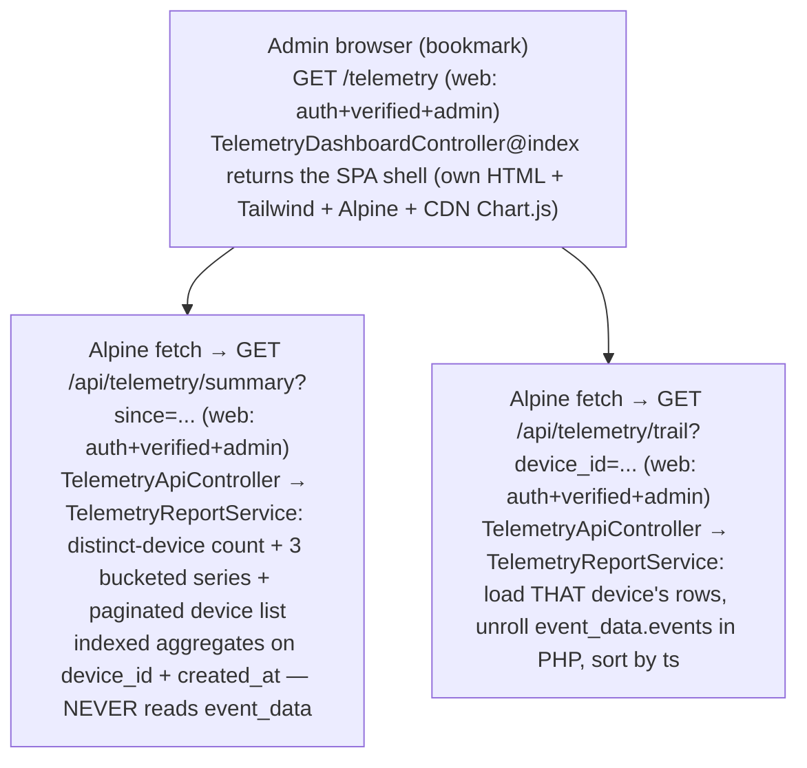

# Telemetry Admin View — Plan (Logger side)

> **Reference architecture, NOT execution steps.** Execute from
> `docs/plans/telemetry-admin-view-prompt.md`. Format per `docs/antigravity-steering.md` §9.
>
> **Context:** This closes the FL-18 "analysis/dashboarding" item that was deferred out of the
> anonymous-telemetry collection slice (`docs/plans/anonymous-telemetry.md`). Collection already shipped:
> the `athlete_events` table + `AthleteEvent` model exist and are being populated by the Athlete app via
> `POST /api/sync/telemetry`. This plan builds a **read-only, admin-gated** page in Logger to look at that
> data. It reads `athlete_events`; it changes NOTHING about collection.

---

## Before You Start (read in order)
```
docs/antigravity-steering.md                     → executor contract: git (NEVER commit), Pint BAN, §6 DB rules, §7 domain folders, §13 Consumer Impact Trace, §14 logic placement, cleanup sweep, AGY_COMPLETE
.kiro/steering/safe-operations.md                → files never to edit, bash/artisan safety, Pint ban
.kiro/steering/project-conventions.md            → domain folders, no column repurposing, read-only intent
.kiro/steering/laravel-boost.md                  → Eloquent (prefer over DB::), constructor promotion, explicit return types, config() not env(), PHPUnit-only
.kiro/steering/git-workflow.md                   → branch assumptions, never push, never merge to main
```

---

## What You're Building

A NEW, standalone, **mobile-first single-page application** in Logger, gated to authenticated
administrators, that visualizes anonymous screen-view telemetry from the existing `athlete_events` table.
Its purpose is a launch-window dashboard: **how many distinct anonymous devices have accessed the app
since a given date, and where any one of them navigated.**

The page is intentionally a **break from the existing web-UI architecture.** It does NOT use
`mobile-entry.flexible`, the `ComponentBuilder` (`C::…`) pattern, or the `@extends('app')` layout. It is a
purpose-built Blade view that renders its own minimal HTML shell (its own `<head>`, its own Tailwind +
Alpine.js) and behaves as a small SPA: an Alpine front end fetches JSON from admin-gated endpoints and
renders three sections client-side. There are **no navigation links pointing to it** anywhere in the app —
it is reached only by directly visiting its URL (a bookmark).

The page has three sections:
- **A — Headline + chart.** A single distinct-device count for the active date range, plus a Chart.js bar
  chart of unique devices over time with a **3-way metric toggle** (new devices per bucket / cumulative
  distinct / active devices per bucket). The Y-axis rescales per metric; the time axis is bucketed to a
  mobile-readable number of bars.
- **B — Paginated device list.** 20 device IDs per page (newest activity first), navigable through all
  pages. Each ID is shortened with an expand-to-full affordance.
- **C — Device trail.** Tapping a device loads its full navigation history — the ordered `{ screen, ts }`
  sequence for that one device.

End state: an admin can bookmark one URL, land on the "since launch" view with zero taps, read the total
and the growth chart, toggle the chart metric, page through devices, and drill into any device's trail —
all on a phone.

---

## Design Decisions (frozen — do not re-litigate)

These were settled during planning. They are constraints, not suggestions.

1. **Read-only.** The page and its endpoints only read `athlete_events`. No writes, no migration, no model
   change, no data migration. `AthleteEvent` and its table already exist (from the collection slice).
2. **Domain folder `app/Telemetry/`** (per steering §7). All new PHP lives here, split by concern:
   `app/Telemetry/Controllers/TelemetryDashboardController.php` (serves the SPA shell),
   `app/Telemetry/Controllers/TelemetryApiController.php` (the JSON data endpoints), and
   `app/Telemetry/Services/TelemetryReportService.php`. Do NOT scatter into `app/Http/Controllers/` or
   `app/Services/`. (This mirrors the `app/Sync/` domain-folder API precedent — its controllers also live
   under `App\Sync\Controllers\`.)
3. **Admin-gated everywhere.** The page route AND both JSON endpoints carry `['auth','verified','admin']`
   (the `admin` alias → `App\Http\Middleware\IsAdmin` → `hasRole('Admin')`). The JSON must NOT be
   world-readable — gating only the page shell is a bug.
4. **Routes split page vs. API, both in `routes/web.php`.**
   - **Page:** `GET /telemetry` → `TelemetryDashboardController@index`, name `telemetry`. Serves the SPA.
   - **Data (API-ish):** `GET /api/telemetry/summary` + `GET /api/telemetry/trail` →
     `TelemetryApiController`, names `telemetry.summary` / `telemetry.trail`. These live under an
     `/api/telemetry` URL prefix so they read as an API, but they are **session-authenticated browser
     calls, not Sanctum**, so they stay in `routes/web.php` inside the same `['auth','verified','admin']`
     group. This deliberately does NOT use `routes/sync.php` / the `api` middleware group: sync uses
     `auth:sanctum` (for the mobile app), whereas these endpoints serve the already-logged-in admin's
     browser session and need the `web`/session middleware for the `admin` gate to see the logged-in user.
     `routes/api.php` is empty and unused, so there is no "app frontend API" convention to follow — the
     `api/telemetry` prefix inside the web group is the correct fit.
5. **Standalone SPA.** Own HTML shell, Tailwind + Alpine + Chart.js. Do NOT reuse `mobile-entry.flexible`,
   `ComponentBuilder`, or `@extends('app')`. Mobile-first only — no desktop layout work.
6. **Chart.js from CDN**, mirroring the existing `public/js/chart-component.js` pattern
   (`https://cdn.jsdelivr.net/npm/chart.js`). Drive it directly from the page's Alpine code — do NOT route
   through the legacy `resources/views/mobile-entry/components/chart.blade.php` component. This adds
   **nothing** to `package.json` (it is a runtime CDN include, and it is the established house pattern —
   explicitly sanctioned here, so the executor does not add an npm package).
7. **Two endpoints.** `summary` (count + 3 chart series + paginated device list) and `trail` (one
   device's ordered history). Chart data is FOLDED INTO the summary response — not a third endpoint.
8. **Date filter — preset chips + native date escape hatch (since-only floor).** Chips:
   `Since launch` (2026-09-01, the DEFAULT — zero taps on load), `30d`, `7d`, `24h`, `12h`, `6h`, `3h`,
   `1h`, `All`. Plus a native `<input type="date">` for an arbitrary custom "since" date. There is no
   upper bound — every filter is an open-ended floor up to now.
9. **Null `device_id` is INCLUDED**, displayed as "no value" (not excluded from count/list).
10. **No JSON unrolling except for a single device's trail.** Sections A (count), A (chart), and B (list)
    use indexed aggregate queries on `device_id` + `created_at` and NEVER read inside `event_data`. Only
    Section C (trail) reads `event_data.events`, and only for one device at a time.
11. **Chart is bucketed by row `created_at`, NOT the inner `ts`.** This keeps the chart off the JSON blob
    entirely (a full-table `ts` unroll is explicitly rejected on performance grounds). `created_at` is
    within seconds of the real event (client flush is debounced ~10s).
12. **No tests.** This is an internal, read-only tool; the user has explicitly waived tests for it. Do NOT
    write feature or unit tests. (This intentionally diverges from `docs/antigravity-steering.md` §4 /
    §10 test-enforcement for THIS plan only, by the user's decision.)
13. **No new dependencies** (npm or composer). Tailwind/Alpine are already built; Chart.js is CDN.

---

## The metrics (Section A chart)

Three series, all bucketed by `created_at`, all computed in one backend pass and returned together so the
toggle is instant (no refetch):

| Toggle | Definition | Reads as |
|---|---|---|
| **New** | Each device counted once, in the bucket of its FIRST-seen `created_at` (within the active range). | Arrival rate. |
| **Cumulative** | Running total of distinct devices first-seen up to and including each bucket. Ends at the Section A headline count. | Growth curve climbing to the total. |
| **Active** | Distinct devices seen in each bucket (a device active in 3 buckets counts in all 3). | Engagement per window. |

Computation (all bounded by device count — hundreds — so trivial on Hobby tier):
- **Active** — `athlete_events` grouped by time bucket, `COUNT(DISTINCT device_id)` per bucket. A
  bucket-truncation expression on `created_at` (query builder + a raw date expression is acceptable here,
  mirroring the reporting precedent in `app/Console/Commands/AnalyzeLiftLogs.php`), OR fetch
  `(device_id, created_at)` in range and bucket in PHP. Either is fine; PHP-bucketing avoids MySQL-only
  date functions.
- **New** — first-seen per device: `device_id → MIN(created_at)` within range; bucket those timestamps.
- **Cumulative** — running sum of **New** in bucket order (computed in PHP after bucketing New).

**Bucket granularity is derived from the active range and capped for a phone** (~12–24 bars max):
`1h/3h/6h` → 5–15 min · `12h/24h` → hourly · `7d` → daily · `30d` → daily/every-few-days ·
`since-launch/all` → daily, collapsing to weekly if the span is long. The backend chooses the bucket size
and returns pre-bucketed series with labels; the phone just draws them.

---

## Diagram L1 — Runtime path (all NEW, all read-only)


---

## Existing Code to Understand (read before modifying)
```
routes/web.php                                       → admin route group `Route::middleware(['auth','verified','admin'])->group(...)` (the users resource). Add ALL telemetry routes here: the page (`telemetry`) and the two `/api/telemetry/*` data endpoints. Session-authed; NO admin/ name prefix.
routes/api.php                                       → EMPTY (stock scaffolding only). There is no "app frontend API" convention; do NOT put telemetry here.
routes/sync.php                                      → the real API precedent: `api/sync/*`, controllers under `App\Sync\Controllers\`, but `auth:sanctum` (mobile app). Telemetry mirrors the domain-folder-controller idea but NOT the Sanctum/api-group wiring — it is session-authed and stays in web.php. Read to understand why (the collection endpoint `POST /api/sync/telemetry` lives here).
bootstrap/app.php                                    → the 'admin' middleware alias → IsAdmin::class (confirm alias). Also shows sync.php registered under `api/sync` with the `api` middleware group — telemetry does NOT do this.
app/Http/Middleware/IsAdmin.php                      → the gate: aborts 403 unless $request->user()->hasRole('Admin'). Reuse via the 'admin' alias; do NOT write new auth.
app/Http/Controllers/UserController.php              → the only existing admin controller. Reference for admin-route wiring ONLY — do NOT copy its ComponentBuilder/mobile-entry.flexible rendering (this page deliberately breaks from that).
app/Sync/Models/AthleteEvent.php                     → the model you READ. $table='athlete_events'; event_data cast to 'array' (shape {events:[{screen,ts},...]}); user() belongsTo; NO SoftDeletes. Do not modify.
database/migrations/2026_09_09_143358_create_athlete_events_table.php → confirms columns: nullable user_id FK, nullable device_id string(36) INDEXED, json event_data, timestamps. Do not modify (already run).
app/Console/Commands/AnalyzeLiftLogs.php             → precedent for read-only reporting aggregates via query builder + DB::raw('COUNT(DISTINCT ...)') / groupBy. Reference pattern for the count + active-per-bucket queries.
public/js/chart-component.js                         → the house Chart.js pattern: dynamically loads https://cdn.jsdelivr.net/npm/chart.js from CDN and calls new Chart(ctx, {...}). Mirror the CDN include; drive Chart.js directly from Alpine (do NOT reuse the chart.blade.php component).
resources/js/app.js                                  → confirms Alpine is the app's JS runtime (window.Alpine = Alpine; Alpine.start()).
```

## Key facts (do not re-discover)
1. `athlete_events` + `AthleteEvent` ALREADY EXIST (collection slice shipped). This plan is READ-ONLY over
   them. No migration, no model edit, no `$fillable`/cast change.
2. Admin access = the `admin` middleware alias (→ `IsAdmin` → `hasRole('Admin')`). There is NO `is_admin`
   column, NO admin gate/policy, NO `Admin/` controller namespace, NO `admin/` route prefix. Existing
   admin routes are flat (`users.*`) inside a `['auth','verified','admin']` group.
8. The data endpoints are session-authenticated (Breeze web session), NOT Sanctum. They MUST sit on the
   `web` middleware stack so the `admin` gate can see the logged-in user — hence they live in
   `routes/web.php` (inside the admin group) under an `/api/telemetry` URL prefix, NOT in `routes/sync.php`
   or `routes/api.php`. Do NOT add `auth:sanctum` and do NOT register them in the `api` middleware group.
3. `device_id` is `string(36)` NULLABLE and INDEXED; `created_at` is indexed via timestamps default? — it
   is a plain timestamp column (no explicit index). Count/list/chart filter on `created_at >= since` and
   group/distinct on `device_id`. At launch scale (hundreds of devices) this is trivial regardless.
4. `event_data` is `'array'`-cast; shape `{ "events": [ { "screen": "...", "ts": "..." }, ... ] }`. Only
   the trail endpoint reads it, and only for one device.
5. `AthleteEvent` has NO SoftDeletes — no trashed-scope concern.
6. There is NO existing charting library in `package.json`; Chart.js is loaded from CDN at runtime by
   `public/js/chart-component.js`. Reuse that CDN approach. Add nothing to `package.json`.
7. Alpine + Tailwind are the app's front-end stack (already built). The SPA shell includes them itself
   rather than extending `app` layout.

---

## Execution Plan
Phases are ordered. **No test checkpoints** (tests waived, §Design Decision 12). The checkpoint after each
phase is a manual/inspection confirmation, plus running the migration is N/A (no migration).

### Phase 1 — Service (the query brain)
- Create `app/Telemetry/Services/TelemetryReportService.php` (PHP 8 constructor promotion if it needs
  deps; explicit return types on every method).
- Methods (names illustrative — descriptive per §8):
  - `summary(Carbon $since, int $page, int $perPage = 20): array` — returns
    `['total' => int, 'series' => ['new' => [...], 'cumulative' => [...], 'active' => [...]],
      'bucket' => '<granularity label>', 'devices' => <paginator payload>]`.
    - `total`: distinct `device_id` count where `created_at >= $since` (null device_id counts as ONE
      "no value" bucket — decide: treat null as a single distinct group labeled "no value").
    - `series`: the three bucketed metrics per §"The metrics". Choose bucket granularity from the span
      (`$since`→now), capped to a mobile-readable bar count. Return `[{label, count}, ...]` per series.
    - `devices`: distinct device IDs (including null → "no value"), ordered by most-recent activity
      (`MAX(created_at)`) desc, paginated `perPage = 20`. Each item:
      `['device_id' => ?string, 'last_seen' => iso8601, 'event_rows' => int]` (event_rows = row count for
      that device; do NOT unroll event_data here).
  - `trail(?string $deviceId, Carbon $since): array` — load that device's `athlete_events` rows where
    `created_at >= $since` (for null device: `whereNull('device_id')`), unroll each row's
    `event_data['events']` in PHP, flatten, sort by `ts` asc, return
    `[{screen, ts}, ...]`. This is the ONLY place event_data is read.
- Use Eloquent / query builder; prefer `AthleteEvent::query()`. Raw date expressions for bucketing are
  acceptable (reporting precedent). Never interpret `event_data` outside `trail()`.
- **Checkpoint:** inspection — service compiles, methods have explicit return types, no event_data read
  outside `trail()`.

### Phase 2 — Controllers + routes
- Create `app/Telemetry/Controllers/TelemetryDashboardController.php` (thin; serves the page only):
  - `index(): View` — return the SPA Blade view. No data assembly here (the SPA fetches JSON).
- Create `app/Telemetry/Controllers/TelemetryApiController.php` (thin; injects `TelemetryReportService`
  via constructor promotion per §14 — the service owns the query dependencies):
  - `summary(Request $request): JsonResponse` — parse `since` (default `2026-09-01`; accept a date string
    or the chips'/input's value) and `page`; return `TelemetryReportService::summary(...)` as JSON.
  - `trail(Request $request): JsonResponse` — parse `device_id` (nullable → "no value" device) and
    `since`; return `TelemetryReportService::trail(...)` as JSON.
- Routes in `routes/web.php`, all inside a `Route::middleware(['auth','verified','admin'])->group(...)`
  (add a new group or extend the existing admin group):
  - `GET  telemetry`              → `TelemetryDashboardController@index` → name `telemetry`
  - `GET  api/telemetry/summary`  → `TelemetryApiController@summary`     → name `telemetry.summary`
  - `GET  api/telemetry/trail`    → `TelemetryApiController@trail`       → name `telemetry.trail`
- The `/api/telemetry/*` endpoints stay in `routes/web.php` (session auth) — do NOT move them to
  `routes/sync.php`/`routes/api.php`, do NOT add `auth:sanctum`, do NOT register them in the `api`
  middleware group. The `api/telemetry` prefix is a URL convention only; the middleware stack is `web`.
- **Checkpoint:** inspection — all three routes gated by `['auth','verified','admin']` (session/`web`
  stack, no Sanctum); controllers thin; `since` defaults to `2026-09-01`; the Alpine `fetch` calls in the
  view target these named routes so the session cookie rides along (same-origin).

### Phase 3 — The SPA view (mobile-first, own shell)
- Create a dedicated Blade view (e.g. `resources/views/telemetry/dashboard.blade.php`) that renders its
  OWN complete HTML document: `<!doctype html>`, `<head>` with viewport meta (mobile-first), Tailwind
  (match how the app includes it — via the built asset), Alpine, and the CDN Chart.js `<script>` tags
  (mirror `public/js/chart-component.js`: `https://cdn.jsdelivr.net/npm/chart.js` + the date-fns adapter
  if the chosen chart config needs a time axis; a category axis with pre-formatted labels avoids the
  adapter). Do NOT `@extends('app')`, do NOT use `ComponentBuilder`.
- Alpine component drives everything:
  - **Date filter:** chip row (`Since launch`, `30d`, `7d`, `24h`, `12h`, `6h`, `3h`, `1h`, `All`) + a
    native `<input type="date">`. Selecting any chip or the input sets `since` and refetches `summary`.
    Default on load = `Since launch` (2026-09-01), zero taps. `All` = a floor far enough back to include
    everything (e.g. epoch / a fixed early date). Chips are since-only floors.
  - **Section A:** headline `total`; a `<canvas>` Chart.js bar chart; a 3-way metric toggle
    (New / Cumulative / Active) that swaps the dataset + rescales the Y-axis via `chart.update()` (no
    refetch — all three series are already in the summary payload). Subtle gridlines for scan-across.
    Respect mobile density (the backend already caps bucket count).
  - **Section B:** the paginated device list (20/page) with prev/next paging that refetches `summary` with
    the new `page`. Each device ID shown shortened (e.g. first 8 chars + `…`) with a tap/expand to reveal
    the full UUID; null device shows "no value". Tapping a device selects it and fetches `trail`.
  - **Section C:** the selected device's ordered trail (`screen` + formatted `ts`), newest device's data
    fetched from `telemetry.trail`. Show an empty/placeholder state before a device is selected.
- Mobile-first Tailwind only; no desktop breakpoints required.
- **Checkpoint:** inspection — view is a standalone document (no `@extends`), Chart.js from CDN, all fetch
  calls hit the admin-gated named routes, toggle rescales axis without refetch.

### Phase 4 — Verification + cleanup sweep
- Manual sanity (no automated tests): confirm `/telemetry` requires admin (redirects/403 when not admin),
  the summary + trail endpoints return JSON and are equally gated, the default view is "since launch",
  the toggle switches metric + axis, pagination works, device expand works, null device shows "no value".
- Cleanup sweep (`docs/antigravity-steering.md` §4): no unused `use`, no dead branches, no commented-out
  code, no stray `dd()`/`dump()`/debug logging, no leftover temp scripts, no `.test-output.txt`. Grep the
  new class/route names to confirm nothing orphaned.

---

## Consumer Impact Trace (`docs/antigravity-steering.md` §13)

**No data shape changes.** This plan adds NO column, NO cast, NO model change, NO event payload change. It
only READS the existing `athlete_events` shape. Therefore the trace is short:

| Structure | Reads / interprets it | Action |
|---|---|---|
| `athlete_events` (existing) | NEW `TelemetryReportService` (read-only) | Add read queries; count + bucketed series (created_at, device_id) + per-device trail (event_data.events). Do NOT modify the table or model. |
| `event_data` (existing, opaque JSON) | ONLY `TelemetryReportService::trail()` | Unroll `.events` for ONE device at read time; sort by `ts`. No other reader interprets it. |
| NEW `app/Telemetry/` controllers (Dashboard + Api) + service | the 3 new routes | Thin controllers → service; admin-gated. Page controller serves the SPA; Api controller returns JSON. |
| NEW routes in `routes/web.php` | admin browser only | `telemetry` (page) + `api/telemetry/summary` + `api/telemetry/trail`; all `['auth','verified','admin']` (session/`web` stack, no Sanctum). |
| Existing collection endpoint (`POST /api/sync/telemetry`), `AthleteEvent`, its migration | — | UNCHANGED. This plan is additive and read-only; collection is untouched. |

**Tests to add:** NONE (waived by the user for this internal read-only tool — §Design Decision 12).

## Simplicity Criteria
- ONE domain folder, TWO thin controllers (page + api), ONE service, THREE routes (1 page + 2
  `/api/telemetry/*`), ONE Blade SPA view. No migration, no model change, no data migration, no new
  dependency, no tests, no change to any existing endpoint or the collection slice.

## Hard Rules
- **NEVER commit/push. NEVER Pint. NEVER destructive DB** (`migrate:fresh`/`reset`/`db:wipe`).
- Do NOT modify `athlete_events`, `AthleteEvent`, the collection migration, or the collection endpoint.
- Do NOT read `event_data` anywhere except the single-device `trail()`.
- Do NOT gate only the page — BOTH JSON endpoints must carry `['auth','verified','admin']`.
- Do NOT use `mobile-entry.flexible`, `ComponentBuilder`, or `@extends('app')` — standalone SPA shell.
- Do NOT add an npm/composer dependency — Chart.js is a CDN include (house pattern).
- Do NOT add navigation/links to the page anywhere in the app.
- Do NOT write tests.

## Implementation Rules
- All PHP in `app/Telemetry/` (per §7): `Controllers/TelemetryDashboardController.php` (page),
  `Controllers/TelemetryApiController.php` (JSON), `Services/TelemetryReportService.php`. View in
  `resources/views/telemetry/`. All routes in `routes/web.php` (session/`web` stack; data endpoints under
  the `/api/telemetry` URL prefix, NOT Sanctum, NOT the `api` group, NOT `sync.php`).
- Eloquent / query builder; prefer `AthleteEvent::query()`. Raw date-bucket expressions acceptable
  (reporting precedent) — but never interpret `event_data` outside `trail()`.
- PHP 8 constructor promotion; explicit return types on every method; `config()` not `env()`.
- Named routes + `route()`: `telemetry` (page), `telemetry.summary` + `telemetry.trail` (data, `/api/telemetry/*` URLs).
- `since` default = `2026-09-01`. Null `device_id` → "no value" (included). Bucket count capped for mobile.
- `--no-interaction` on any artisan `make:` used to scaffold.

## Success Criteria
- [ ] `GET /telemetry` (`TelemetryDashboardController@index`) renders a standalone mobile-first SPA (own
      HTML shell; NOT `@extends('app')`, NOT `mobile-entry.flexible`/`ComponentBuilder`), gated by
      `['auth','verified','admin']`.
- [ ] `GET /api/telemetry/summary` and `GET /api/telemetry/trail` (`TelemetryApiController`) return JSON,
      are BOTH admin-gated on the session/`web` stack (no Sanctum, not in `sync.php`/`api.php`).
- [ ] Section A shows the distinct-device total for the active `since` and a Chart.js bar chart (CDN) with
      a working New/Cumulative/Active toggle that rescales the Y-axis without refetching; gridlines
      present; bucket count mobile-capped; bucketed by `created_at`.
- [ ] Section B lists 20 devices/page, newest activity first, pages through all; device IDs shortened with
      expand-to-full; null `device_id` shown as "no value".
- [ ] Section C shows a selected device's full ordered screen trail (unrolled from `event_data.events` for
      that one device, sorted by `ts`).
- [ ] Date filter: chips (`Since launch`/2026-09-01 default, `30d`, `7d`, `24h`, `12h`, `6h`, `3h`, `1h`,
      `All`) + native date input; default load = since launch, zero taps.
- [ ] All new PHP under `app/Telemetry/` (Dashboard controller + Api controller + service); no migration,
      no model change, no change to the collection slice.
- [ ] No new npm/composer dependency; Chart.js via CDN. No tests written. Cleanup sweep clean. No commits.

## Do Not
- Do NOT modify `athlete_events` / `AthleteEvent` / the collection migration / `POST /api/sync/telemetry`.
- Do NOT interpret `event_data` outside the single-device trail.
- Do NOT leave any JSON endpoint ungated.
- Do NOT use the legacy layout/ComponentBuilder/chart.blade.php.
- Do NOT add dependencies, navigation links, or tests.
- Do NOT commit/push, run Pint, or run destructive DB commands.

## Post-Execution Retro (authored by the REVIEWER, not the executor — leave placeholders)
- **Attempts:** {1 (clean) / N + root cause}
- **Tests added:** {count}
- **Prompt improvements for next time:** {…}
- **Steering updates needed:** {yes/no + what}
