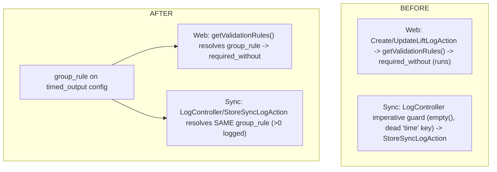

# Timed-Reps Field-Shape Hardening — Plan (Logger side)

> **Reference architecture, NOT execution steps.** Execute from
> `docs/plans/timed-reps-field-shape-hardening-prompt.md`. Format per `docs/antigravity-steering.md` §9.
>
> **Cross-repo:** This is the **Logger slice (Slice B)** of the hardening effort owned by
> `../../docs/plans/timed-reps-field-shape-hardening-cross-repo.md` (FROZEN §1–§6 = source of truth). It
> follows the shipped `timed-reps-logtype` Logger slice and builds on it. Athlete (Slice A) runs FIRST;
> contracts LAST. NO new column, NO enum change, NO data migration.

---

## Before You Start (read in order)
```
docs/antigravity-steering.md                     → git (NEVER commit), Pint BAN, DB rules, milestones, §13 trace, §14 sweep, AGY_COMPLETE
.kiro/steering/safe-operations.md                → protected files, artisan safety, Pint ban (wins)
.kiro/steering/project-conventions.md            → Actions pattern, Form Request validation, dispatch events
.kiro/steering/sync-api-context.md               → sync ingress (LogController/StoreSyncLogAction), strategy pattern
.kiro/steering/laravel-boost.md                  → Eloquent not DB::, constructor promotion, explicit return types, PHPUnit-only
```
Cross-repo source of truth (read, do not edit): `../../docs/plans/timed-reps-field-shape-hardening-cross-repo.md`
(FROZEN §1–§6). Prior art (read, do not edit): `docs/plans/timed-reps-logtype.md`.

---

## What You're Building

Two fixes rooted in FROZEN §3 and §4:

1. **ONE validation rule on BOTH paths (§3).** Today the `timed_output` `required_without` config runs only
   on the WEB form (`Create/UpdateLiftLogAction` → `getValidationRules()`); the SYNC path
   (`LogController::store` → `StoreSyncLogAction`) enforces "≥1 of {time,reps}" via a hand-written
   imperative guard with a dead `time` key and `empty()` semantics. Consolidate to a single declarative
   `group_rule` on the type config + a shared validator invoked by BOTH paths, using the `> 0` definition
   of "logged" (matching Athlete). Remove the imperative `LogController` guard.
2. **The web edit form must never 500 on a missing `ariaLabels` (§4).** `LiftLogFormFactory::buildFields`
   only attaches `ariaLabels` for `numeric`/`select` field types; the `timed_output` strategy's inherited
   field defs miss it and `form-field.blade.php` reads `$field['ariaLabels']['field']` with no null-safety
   → `Undefined array key "ariaLabels"` on `GET /lift-logs/{id}/edit`. Fix BOTH: the factory attaches
   `ariaLabels` for every field type, AND the partial reads it defensively.

**Scope:** No new column, no `pr_type`/enum change, no data migration. Zero behavioral change to any
exercise type other than `timed_output`'s validation path + the (type-agnostic) form-factory/template
hardening — which must be behavior-identical for all existing types.

### FROZEN §3 — declarative group rule + shared validator
`config/exercise_types.php` `timed_output` gains:
```php
'optional_fields' => ['time', 'reps'],
'group_rule' => ['kind' => 'require_one_of', 'fields' => ['time', 'reps']],
'validation' => [
  'time' => 'nullable|integer|min:1|max:900|required_without:reps',
  'reps' => 'nullable|integer|min:1|max:1000|required_without:time',
],
```
A shared helper resolves `group_rule` → the enforcement and is called by BOTH:
- **Web:** already flows through `getValidationRules()` (the `validation` array). Keep that; the
  `required_without` pair IS the `require_one_of` rule expressed as Laravel rules.
- **Sync:** `LogController`/`StoreSyncLogAction` must invoke the SAME rule (resolve the exercise's strategy
  `group_rule` and validate each set against it) INSTEAD of the imperative guard. The guard (with its dead
  `$set['time']` key and ad-hoc `empty()`) is deleted.
- "Logged" = `> 0` (a `0` is treated as not-present, matching Athlete's coerced-null payload). Since
  Athlete now sends `null` for a not-logged field (Slice A), the sync payload and this rule agree.

### FROZEN §4 — form factory + template hardening
- `LiftLogFormFactory::buildFields`: attach an `ariaLabels` array (`field`, and for numeric `decrease`/
  `increase`) for EVERY field type it emits — a documented default from the field label. No field def
  leaves the factory without `ariaLabels`.
- `resources/views/mobile-entry/components/form-field.blade.php`: read `ariaLabels` DEFENSIVELY on every
  branch — `{{ $field['ariaLabels']['field'] ?? '' }}`, `{{ $field['ariaLabels']['decrease'] ?? '' }}`,
  `{{ $field['ariaLabels']['increase'] ?? '' }}`. Defense-in-depth: a malformed field def degrades to an
  empty aria-label, never a 500.

---

## Diagram L1 — Validation paths (before → after)


## Existing Code to Understand (read before modifying)
```
config/exercise_types.php                             → timed_output entry. ADD optional_fields + group_rule.
app/Actions/LiftLogs/CreateLiftLogAction.php          → web create; merges getValidationRules(). Keep (it already enforces the rule).
app/Actions/LiftLogs/UpdateLiftLogAction.php          → web update; same.
app/Services/ExerciseTypes/BaseExerciseType.php       → getValidationRules() returns config['validation']. Optionally derive from group_rule here (single source).
app/Sync/Controllers/LogController.php                → REMOVE the imperative timed-reps guard; invoke the shared group_rule validation.
app/Sync/Actions/StoreSyncLogAction.php               → sync persistence; wire the shared per-set group-rule check here or in LogController.
app/Services/Factories/LiftLogFormFactory.php         → buildFields(): attach ariaLabels for EVERY field type (not only numeric/select).
resources/views/mobile-entry/components/form-field.blade.php → read ariaLabels defensively on every branch.
app/Services/ExerciseTypes/TimedOutputExerciseType.php → getFormFieldDefinitions (inherited base) — confirm time+reps fields carry what the factory needs.
```

## Key facts (do not re-discover)
1. Web validation flows via `getValidationRules()` (config `validation`); sync validation does NOT — it's
   the imperative `LogController` guard. That split is the bug (§3).
2. `personal_records.pr_type` is `VARCHAR(32)`; no enum/migration concerns here.
3. `form-field.blade.php` reads `$field['ariaLabels'][...]` on EVERY input branch with no null-safety; the
   factory only sets it for numeric/select → the 500 (§4).
4. No new column: `timed-reps` reuses `lift_sets.time`/`reps` (nullable). No data migration.

## Execution Plan (decomposed per `docs/antigravity-steering.md` §15)
Checkpoints use `php artisan test --parallel`.

### Phase 1 — group_rule config + shared validator on both paths
- `config/exercise_types.php`: add `optional_fields` + `group_rule` to `timed_output` (keep the
  `required_without` `validation` pair — it is the web expression of the rule).
- Add a shared helper (e.g. a small `SetGroupRuleValidator` or a method on the strategy/base) that, given a
  logType/strategy and a set's data, enforces `group_rule` using the `> 0` "logged" definition. Web path:
  ensure `getValidationRules()` still yields the `required_without` pair (no behavior change). Sync path:
  `LogController`/`StoreSyncLogAction` calls the shared validator per set and throws a 422
  `ValidationException` when unsatisfied.
- DELETE the imperative `timed-reps` guard in `LogController` (with its dead `$set['time']` key).
- Tests: web create/update of a timed-reps log rejects all-null and both-`0`, accepts either-one (feature
  test); sync POST rejects all-null/all-`0`, accepts either-one; a valid Athlete payload (null for
  not-logged) is accepted and persists nulls. Existing validation for other types unchanged.
- **Checkpoint.**

### Phase 2 — form factory ariaLabels for every field type + defensive template
- `LiftLogFormFactory::buildFields`: attach `ariaLabels` for EVERY emitted field type (text/date/textarea/
  file/etc.), default from the label; numeric keeps `decrease`/`increase`; add `field` where the template
  reads it. No field def without `ariaLabels`.
- `form-field.blade.php`: null-coalesce every `ariaLabels` access on every branch.
- Feature test: `GET /lift-logs/{id}/edit` for a synced `timed-reps` log returns 200 and renders the
  time + reps fields (no `Undefined array key`). Add a defensive unit/feature test that a field def WITHOUT
  `ariaLabels` still renders (degrades to empty aria-label, no exception).
- **Checkpoint.**

### Phase 3 — Verification + cleanup sweep
- Full suite green (all existing types' web forms + validation unchanged). §14 sweep: no dead guard
  residue, no unused `use`, delete `.test-output.txt`.

## Consumer Impact Trace (mandatory — `docs/antigravity-steering.md` §13)
| Structure changed | Reads / interprets it | Action |
|---|---|---|
| `timed_output` config + `group_rule`/`optional_fields` | `getValidationRules()` (web), shared validator (sync), form factory | Add keys; web rule unchanged; sync now uses the shared rule. |
| Removed `LogController` imperative guard | sync ingress | Replaced by shared validator; confirm no other logType relied on the guard (it was timed-reps-only). |
| Shared group-rule validator (new) | `LogController`/`StoreSyncLogAction` (sync) + web actions | Both paths enforce identically; a valid null-for-not-logged payload passes. |
| `LiftLogFormFactory::buildFields` ariaLabels for all types | `form-field.blade.php` (every field) | Every field def carries ariaLabels; verify existing types' forms render identically (aria strings unchanged for numeric/select). |
| `form-field.blade.php` defensive reads | all web logging/edit forms | Null-safe on every branch; existing forms behave identically (keys present → same output). |

**Tests to add/update:** a sync feature test (all-null/all-0 rejected, either-one accepted, null persists),
a web edit render test for timed-reps (200, no exception), a factory test that a field def lacking
`ariaLabels` still renders. Confirm existing `TimedRepsSyncTest` + form/validation tests still pass.

## Simplicity Criteria
- ONE `group_rule` per type + ONE shared validator on both paths. The form fix is: factory always sets
  `ariaLabels` + template always null-safe. No new column, enum, or migration.

## Hard Rules
- **NEVER commit/push. NEVER Pint. NEVER destructive DB.** Never modify a run migration.
- Do NOT keep the imperative sync guard alongside the shared validator (that reintroduces the two-dialect
  smell). Do NOT change validation for any type other than `timed_output`.

## Implementation Rules
- Eloquent not `DB::`. Constructor promotion; explicit return types. PHPUnit; factories. `--no-interaction`.
  Form Request / config-driven validation, not inline ad-hoc guards.

## Success Criteria
- [ ] ONE `group_rule` drives `timed_output` validation on BOTH web and sync; imperative `LogController`
      guard removed; a valid null-for-not-logged payload accepted, all-null/all-0 rejected identically on
      both paths.
- [ ] `GET /lift-logs/{id}/edit` renders a `timed-reps` log with no exception; every field def carries
      `ariaLabels`; the partial is null-safe on every branch.
- [ ] All existing types' web forms + validation behavior-identical. `php artisan test --parallel` green;
      sweep clean. No new column/enum/migration, no deps, no commits.

## Do Not
- Do NOT keep two validation dialects. Do NOT change other types' validation. Do NOT add a column/migration.
- Do NOT edit historical migrations or any `contracts/` file.

## Post-Execution Retro (filled after completion; then move plan+prompt to `completed/`)
- **Attempts:** {1 (clean) / N + root cause}
- **Tests added:** {count}
- **Prompt improvements for next time:** {…}
- **Steering updates needed:** {yes/no + what}
