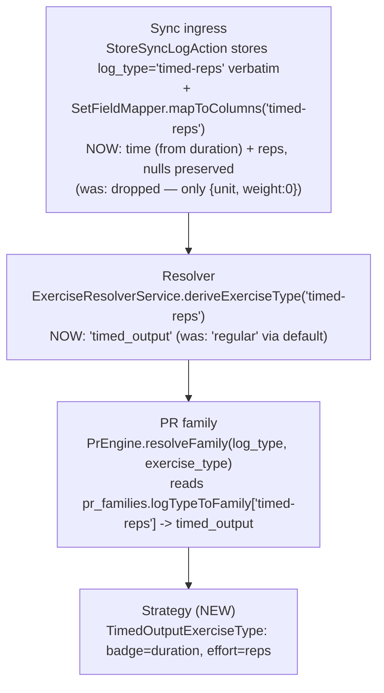

# Timed-Reps LogType — Plan (Logger side)

> **Reference architecture, NOT execution steps.** Execute from `docs/plans/timed-reps-logtype-prompt.md`.
> Format per `docs/antigravity-steering.md` §9.
>
> **Cross-repo:** This is the **Logger slice (Slice A)** of the effort owned by the root plan
> `../../docs/plans/timed-reps-logtype-cross-repo.md`. Its **FROZEN §1–§6** is the source of truth for all
> shared names, the PR family shape, the validation rule, and the field mapping. Do NOT re-decide them
> here. Logger runs FIRST; contracts LAST. This introduces a NEW `timed_output` family + display strategy;
> `pr_type` is already `VARCHAR(32)` (no enum migration — FROZEN §4).

---

## Before You Start (read in order)
```
docs/antigravity-steering.md                     → executor contract: git (NEVER commit), Pint BAN, DB rules, milestones, §13 trace, §15 decomposition, AGY_COMPLETE
.kiro/steering/project-conventions.md            → forward-only migrations, no column repurposing, dispatch events, soft deletes
.kiro/steering/sync-api-context.md               → exercise-type strategy pattern, PR dispatch, data model
.kiro/steering/laravel-boost.md                  → Eloquent not DB::, constructor promotion, explicit return types, PHPUnit-only
```
Cross-repo source of truth (read, do not edit): `../../docs/plans/timed-reps-logtype-cross-repo.md`
(FROZEN §1–§6). Prior art (read, do not edit): `docs/plans/carry-logtype-system.md` (the sibling logType
slice), `app/Services/ExerciseTypes/StaticHoldExerciseType.php` (closest duration strategy),
`app/Services/ExerciseTypes/LoadOutputExerciseType.php` (multi-field badge/effort pattern).

---

## What You're Building

Wire the **`timed-reps`** logType (dynamic movements dosed by time, e.g. Glute Bridge March) through
Logger's sync, display, and PR layers. It is a **dual-optional-metric** type: an athlete logs `duration`
and/or `reps`; either may be null. Four things:

1. **`SetFieldMapper`** — a `timed-reps` arm in both directions. `duration`→`time`, `reps`→`reps`, **nulls
   preserved** (never coerced to 0).
2. **`deriveExerciseType('timed-reps') → 'timed_output'`** (new exercise_type string).
3. **`TimedOutputExerciseType`** — a NEW display strategy: badge = duration, effort = reps, reps NOT
   nulled (unlike `static_hold`). Plus its `config/exercise_types.php` entry with `required_without`
   validation (FROZEN §3).
4. **`timed_output` PR family** — a NEW family in `config/pr_families.php` (4 descriptors, FROZEN §4) +
   `logTypeToFamily['timed-reps'] = 'timed_output'`.

**Scope note (FROZEN §4):** `personal_records.pr_type` is `VARCHAR(32) NULL` (migration
`2026_08_31_145200_change_pr_type_to_varchar.php`) — the new type string `max_reps` needs **NO enum
migration**. Descriptors 1/2/4 reuse existing type strings (`time`, `volume`, `bodyweight_volume`). No new
DB column: `timed-reps` reuses `lift_sets.time` + `lift_sets.reps` (both already nullable). **No data
migration is anticipated** (new logType, no existing exercises to re-type). Zero behavioral change to
`static_hold` or any existing type.

### FROZEN §4 — the `timed_output` PR family (mirror EXACTLY into `config/pr_families.php`)

All four: `compare => 'scalarBest'`, `direction => 'max'`, `tolerance => 'none'`, `store => 'scalar'`.

| # | type | reduce | field | label | format |
|---|------|--------|-------|-------|--------|
| 1 | `time` | `maxOf` | `time` | Longest Duration | `seconds` |
| 2 | `volume` | `sumOf` | `time` | Total Time | `seconds` |
| 3 | `max_reps` | `maxOf` | `reps` | Most Reps | `reps` |
| 4 | `bodyweight_volume` | `sumOf` | `reps` | Total Reps | `reps` |

> Descriptor 3 points the existing field-generic `maxOf` reduction at `reps`. Confirm Logger's
> `Reductions::maxOf` (and `sumOf`) read the descriptor `field` generically and skip non-positive values
> (the "not logged" mechanism) — if so, this is config-only, no engine code change.

### FROZEN §5 — `TimedOutputExerciseType` display

- `getTypeName()` → `'timed_output'`.
- `formatSingleSetBadge($set)` → duration string from `$set->time` (`{n}s` / `{m}m {s}s`); **empty string
  when time is null/0** (reps-only set shows no duration badge).
- `getSetEffortValue($set)` → reps (base default returns reps — keep it).
- `processLiftData($data)` → MUST NOT null reps (do NOT copy static_hold's `reps = 1`). Preserve both
  dimensions as stored. Nullify `band_color` (not applicable).
- Three display states render sensibly: reps-only (`3 × 12`, no badge), duration-only (`3 × 40s`), both
  (`3 × 12 - 40s`-style — mirror the base `formatBadgeGroupLabel`). Freeze exact strings in unit tests.

### FROZEN §3 — validation (`config/exercise_types.php` `timed_output`)

`time => 'nullable|integer|min:1|max:900|required_without:reps'`,
`reps => 'nullable|integer|min:1|max:1000|required_without:time'`. This mirrors the Athlete `requireOneOf`.
`supports_1rm => false`, `form_fields => ['time', 'reps']`.

---

## Diagram L1 — Runtime path (what changes)


---

## Existing Code to Understand (read before modifying)
```
config/pr_families.php                                → families[] + logTypeToFamily. ADD 'timed_output' family (4 descriptors) + 'timed-reps' => 'timed_output'.
app/Services/PR/PrEngine.php                          → resolveFamily() + Reductions (maxOf/sumOf). CONFIRM field-generic + null-skip; NO change expected.
app/Sync/Services/ExerciseResolverService.php         → deriveExerciseType() match. ADD 'timed-reps' => 'timed_output'.
app/Sync/Services/SetFieldMapper.php                  → mapToColumns()/mapFromColumns() switch, no default. ADD 'timed-reps' arm both directions (time<->duration, reps<->reps, nulls preserved).
app/Services/ExerciseTypes/StaticHoldExerciseType.php → CLOSEST duration strategy — but nulls reps; do NOT copy that. Copy formatDuration.
app/Services/ExerciseTypes/LoadOutputExerciseType.php → multi-field badge/effort precedent.
app/Services/ExerciseTypes/BaseExerciseType.php       → formatMobileSummaryDisplay template; getSetEffortValue default = reps.
app/Services/ExerciseTypes/ExerciseTypeFactory.php    → config-driven type→class. NEW 'timed_output' entry needed in exercise_types.php.
config/exercise_types.php                             → per-type config. ADD 'timed_output' entry (class, validation, form_fields).
app/Models/{LiftLog,LiftSet,PersonalRecord}.php       → LiftSet has time + reps columns (nullable). pr_type is VARCHAR(32).
```

## Key facts (do not re-discover)
1. `exercises.exercise_type`/`.log_type` and `lift_logs.log_type` are plain string columns → no schema
   migration for `timed-reps`/`timed_output`.
2. `personal_records.pr_type` is `VARCHAR(32) NULL` (not an enum) → `max_reps` needs NO enum migration.
3. `lift_sets.time` + `lift_sets.reps` already exist and are nullable → `timed-reps` reuses them; no new
   column, no data migration.
4. `deriveExerciseType()` runs on auto-create; Logger auto-creates exercises by name on sync → a
   `timed-reps` exercise materializes as `timed_output` organically on first sync.
5. `ExerciseTypeFactory` is config-driven off `exercise_types.types.{type}.class` → the new strategy needs
   a config entry to be constructed.

---

## Execution Plan (decomposed per `docs/antigravity-steering.md` §15)
Checkpoints use `php artisan test --parallel`.

### Phase 1 — SetFieldMapper + resolver + family map + unit tests
- `SetFieldMapper::mapToColumns()`: add `case 'timed-reps':` → `$columns['time'] = $setData['duration'] ??
  null; $columns['reps'] = $setData['reps'] ?? null;` (weight stays the default 0).
- `SetFieldMapper::mapFromColumns()`: add `case 'timed-reps':` → `['duration' => $set->time, 'reps' =>
  $set->reps]`.
- `ExerciseResolverService::deriveExerciseType()`: add `'timed-reps' => 'timed_output'` arm.
- `config/pr_families.php`: add the `timed_output` family (4 descriptors, FROZEN §4) + `logTypeToFamily
  ['timed-reps'] => 'timed_output'`.
- Unit tests: `deriveExerciseType('timed-reps') === 'timed_output'`; `PrEngine::resolveFamily` →
  `timed_output`; `mapToColumns`/`mapFromColumns` round-trip for (a) both fields present, (b) reps-only
  (duration null), (c) duration-only (reps null) — assert nulls preserved, never 0.
- **Checkpoint.**

### Phase 2 — TimedOutputExerciseType + config + display unit tests
- New `app/Services/ExerciseTypes/TimedOutputExerciseType.php` (FROZEN §5): `getTypeName`,
  `formatSingleSetBadge` (duration, empty when null/0), `getSetEffortValue` (reps — inherit),
  `processLiftData` (preserve reps, nullify band_color), `formatDuration` (copy from StaticHold),
  `canCalculate1RM => false`, `format1RMTableCellDisplay => 'N/A'`, `getTypeDisplayInfo`, `getChartTitle`.
- `config/exercise_types.php`: add `timed_output` entry (`class => TimedOutputExerciseType::class`,
  validation per FROZEN §3, `supports_1rm => false`, `form_fields => ['time','reps']`, field labels).
- Unit tests via `formatMobileSummaryDisplay`: reps-only set → repsSets non-zero, no duration badge;
  duration-only → duration badge, sets shown; both → badge + reps effort. Assert reps NOT forced to 1.
- **Checkpoint.**

### Phase 3 — Sync feature test (accept + persist + PR + restore)
- Feature test: POST `/api/squirby/logs` for a `timed-reps` exercise with (a) duration+reps, (b) reps-only,
  (c) duration-only → each auto-creates `timed_output`, persists `time`/`reps` (null preserved), records
  the `timed_output` PRs it should (both-dims log → duration + reps PRs; reps-only → reps PRs only;
  duration-only → duration PRs only).
- Feature test: `GET /restore` returns `duration` + `reps` for a `timed-reps` set, nulls intact.
- Feature test: validation rejects a set with BOTH `time` and `reps` null (required_without pair).
- **Checkpoint.**

### Phase 4 — Verification + cleanup sweep
- Full suite green. §14 cleanup sweep: no unused `use`, no dead branch, no static_hold copy-paste residue
  (esp. no `reps = 1`), delete `.test-output.txt`.

---

## Consumer Impact Trace (mandatory — `docs/antigravity-steering.md` §13)
| Structure changed | Reads / interprets it | Action |
|---|---|---|
| `SetFieldMapper` + `timed-reps` arm | `StoreSyncLogAction` (write); `RestoreController`/`ChangesController` (read) | Add the arm; without it `timed-reps` set fields are dropped (the core bug). |
| `deriveExerciseType()` + `timed-reps` | `ExerciseResolverService::resolve()` on auto-create | Add `=> 'timed_output'`; a synced timed-reps exercise materializes correctly. |
| `logTypeToFamily['timed-reps']` | `PrEngine::resolveFamily`; root family-parity fixture | Add → `timed_output`. Contract slice C updates the parity fixture (not from this repo). |
| NEW `timed_output` family (4 descriptors) | `PrEngine` compute/detect; `PRRecalculationService` | New family; `time`/`reps` read via existing field-generic reductions. Confirm maxOf/sumOf field-generic + null-skip. |
| NEW `timed_output` exercise_type + strategy | `ExerciseTypeFactory::create`; web UI exercise pages/charts, mobile summary, feed | New strategy renders duration+reps; verify a timed-reps log renders (not `regular`/`static_hold`). |
| `pr_type = 'max_reps'` (new string) | `personal_records.pr_type` (VARCHAR32); PR list/table views, celebrations | No enum change. Verify PR views render a `max_reps` row (label "Most Reps"). |

**Tests to add (no existing test asserts a `timed-reps` shape — it's new):** a `SetFieldMapperTest`
timed-reps round-trip (3 null-combos), an `ExerciseResolverServiceTest` derive case, a `PrEngine`/
resolveFamily case, a `TimedOutputExerciseType` display test, and a Sync feature test (3 log states +
both-null rejection).

## Simplicity Criteria
- ONE `timed-reps` arm per mapper direction. The family is 4 config descriptors reusing existing
  reductions. The strategy is the base + two overrides + `formatDuration`. No migration, no enum change,
  no new column.

## Hard Rules
- **NEVER commit/push. NEVER Pint. NEVER destructive DB.** Never modify a run migration.
- Do NOT null reps in `processLiftData` (that is static_hold behavior; it destroys the reps dimension).
- Do NOT coerce a null/unlogged dimension to 0 in the mapper.

## Implementation Rules
- Eloquent not `DB::`. Constructor promotion; explicit return types. PHPUnit only; factories.
  `--no-interaction`. New strategy follows the `ExerciseTypeInterface`/`BaseExerciseType` pattern.

## Success Criteria
- [ ] `mapToColumns`/`mapFromColumns` persist + round-trip `timed-reps` duration & reps; nulls preserved.
- [ ] `deriveExerciseType('timed-reps') === 'timed_output'`; `resolveFamily` → `timed_output`.
- [ ] `TimedOutputExerciseType` renders badge=duration + effort=reps for all 3 log states; reps NOT nulled.
- [ ] `timed_output` family (4 descriptors) records duration PRs and reps PRs independently.
- [ ] Validation rejects both-null; accepts either-one. `php artisan test --parallel` green; sweep clean.
- [ ] No new column, no enum migration, no new deps, no commits.

## Do Not
- Do NOT route `timed-reps` to `static_hold`/`regular`. Do NOT null reps. Do NOT coerce null→0.
- Do NOT add a column or data migration. Do NOT edit historical migrations or any `contracts/` file.

## Post-Execution Retro (filled after completion; then move plan+prompt to `completed/`)
- **Attempts:** {1 (clean) / N + root cause}
- **Tests added:** {count}
- **Prompt improvements for next time:** {…}
- **Steering updates needed:** {yes/no + what}
