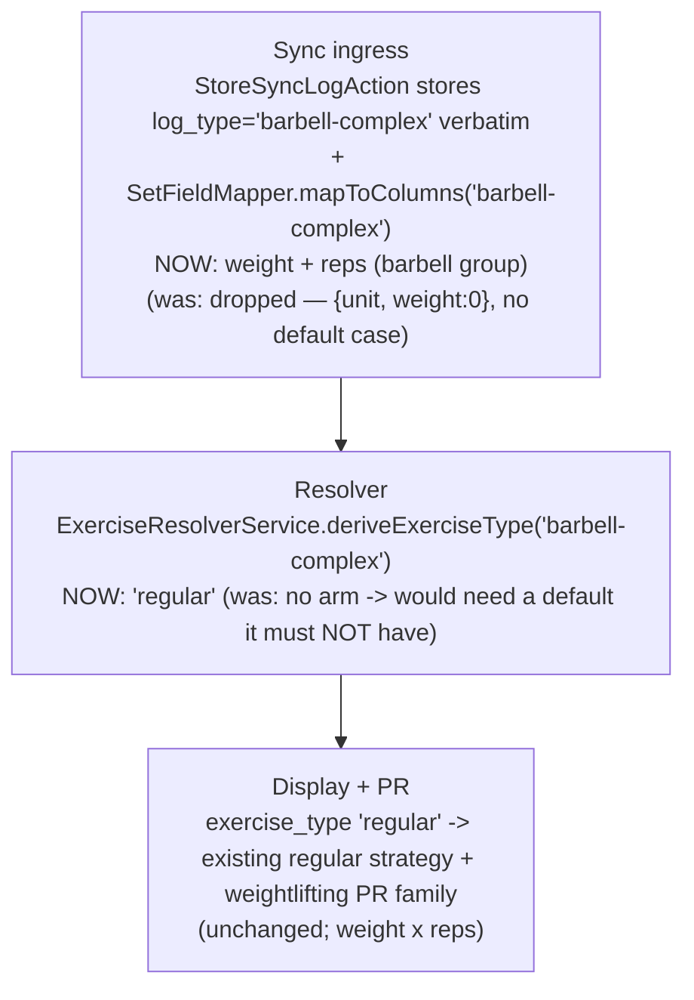

# Olympic-Complex `barbell-complex` Recognition — Plan (Logger side)

> **Reference architecture, NOT execution steps.** Execute from
> `docs/plans/olympic-complex-reps-and-logging-prompt.md`. Format per `docs/antigravity-steering.md` §9.
>
> **Cross-repo:** This is the **Logger slice (Slice B)** of the effort owned by the root plan
> `../../docs/plans/olympic-complex-reps-and-logging-cross-repo.md`. Its **FROZEN §1–§6** is the source of
> truth for the `barbell-complex` shape and routing. Do NOT re-decide it here. Athlete runs FIRST; contracts
> LAST. This is **additive aliasing only** — no new column, no migration, no new strategy, no new behavior.

---

## Before You Start (read in order)
```
docs/antigravity-steering.md                     → executor contract: git (NEVER commit), Pint BAN, DB rules, §13 Consumer Impact Trace, milestones, AGY_COMPLETE
.kiro/steering/project-conventions.md            → no column repurposing, dispatch events, soft deletes, one-source-of-truth
.kiro/steering/sync-api-context.md               → exercise-type strategy pattern, SetFieldMapper, data model
.kiro/steering/laravel-boost.md                  → Eloquent not DB::, constructor promotion, explicit return types, PHPUnit-only
```
Cross-repo source of truth (read, do not edit): `../../docs/plans/olympic-complex-reps-and-logging-cross-repo.md`
(FROZEN §1–§6). Prior art (read, do not edit): `docs/plans/timed-reps-logtype.md` (sibling logType slice —
though that one added a strategy; THIS one does not).

---

## What You're Building

Make Logger RECOGNIZE the new athlete logType **`barbell-complex`** (an Olympic barbell complex logged as
one weight+reps unit) so a synced `barbell-complex` set is stored + round-tripped correctly instead of
being silently dropped. `barbell-complex` behaves EXACTLY like `barbell` on the Logger side — same columns
(`weight` + `reps`), same `exercise_type` (`regular`), same display, same PR family. Three one-line
additions:

1. **`SetFieldMapper::mapToColumns`** — add `case 'barbell-complex':` to the EXISTING
   `barbell`/`single-dumbbell`/`dual-dumbbell`/`machine` fall-through group (maps `weight` + `reps`).
2. **`SetFieldMapper::mapFromColumns`** — add `barbell-complex` to the SAME barbell group (returns
   `weight` + `reps`).
3. **`ExerciseResolverService::deriveExerciseType`** — add `barbell-complex` to the `'regular'` match arm.

**Why this matters (the bug being prevented, FROZEN §4):** both the `mapToColumns`/`mapFromColumns` switches
and the `deriveExerciseType` match have **NO default case**. An unrecognized `barbell-complex` would fall to
the switch's no-op path and store only `{ unit, weight: 0 }` — **dropping weight AND reps on sync** (real
data loss). Adding `barbell-complex` to the barbell group routes it correctly.

**Scope note:** NO new column (reuses `lift_sets.weight` + `lift_sets.reps`). NO migration. NO new
`exercise_type` / strategy (`barbell-complex` derives `regular`, handled by the existing regular strategy).
NO data migration. The per-segment reps ride in the opaque `lift_logs.meta` blob (persisted by the PRIOR
meta-persistence effort) — Logger stores/echoes it verbatim and this slice does NOT touch `meta`.

### FROZEN §4 — do NOT add a `default` case
A genuinely-unknown logType must keep failing loudly (dropping to `weight:0`) so the contract test catches
an omission. `barbell-complex` is recognized by being listed ALONGSIDE `barbell` in the existing group —
NOT by introducing a catch-all `default`. Adding a default would mask future missing logTypes.

---

## Diagram L1 — Runtime path (what changes)


---

## Existing Code to Understand (read before modifying)
```
app/Sync/Services/SetFieldMapper.php                  → mapToColumns() + mapFromColumns() switches; barbell group is `case 'barbell': case 'single-dumbbell': case 'dual-dumbbell': case 'machine':`. ADD 'barbell-complex' to BOTH groups. NO default.
app/Sync/Services/ExerciseResolverService.php         → deriveExerciseType() match; `'barbell','single-dumbbell','dual-dumbbell','kettlebell','ball','machine' => 'regular'`. ADD 'barbell-complex' to that arm. Keep `default => 'regular'`? NO — see below.
tests/Unit/Sync/SetFieldMapperTest.php                → mirror an existing barbell round-trip test for barbell-complex.
tests/Unit/Sync/ExerciseResolverServiceTest.php       → mirror the derive test for barbell-complex.
```

## Key facts (do not re-discover)
1. `lift_logs.log_type` + `exercises.log_type`/`.exercise_type` are plain string columns → no schema
   migration for `barbell-complex`/`regular`.
2. `barbell-complex` reuses `lift_sets.weight` + `lift_sets.reps` (both existing) → no new column.
3. `deriveExerciseType` runs on auto-create; Logger auto-creates exercises by name on sync → a
   `barbell-complex` exercise (the athlete BUCKET, e.g. `clean_complex`) materializes as `regular` on first
   sync. (The composition id lives in the opaque `meta`, not in resolution — unchanged.)
4. `mapFromColumns`'s barbell group returns `weight` + `reps` (the fields the regular display + round-trip
   need) — adding `barbell-complex` to it makes a Logger reps edit round-trip back to the athlete.

> **On the existing `deriveExerciseType` `default => 'regular'`:** the `match` arm already has a
> `default => 'regular'`. Read the real code: if `deriveExerciseType` already returns `regular` for an
> unknown logType via its default, adding `barbell-complex` to the explicit arm is still REQUIRED for
> clarity + the contract (the FROZEN spec pins the explicit mapping), but note the NO-DEFAULT rule (FROZEN
> §4) applies specifically to `SetFieldMapper`'s switches (which have no default and DROP fields) — that is
> the data-loss site. Do NOT remove `deriveExerciseType`'s existing `default`; ADD the explicit
> `barbell-complex` arm alongside `barbell` so the intent is legible and the contract's
> `expectedExerciseType: regular` is guaranteed regardless of the default.

---

## Execution Plan
Checkpoints use `php artisan test --parallel`.

### Phase 1 — SetFieldMapper both directions + resolver + unit tests
- `SetFieldMapper::mapToColumns()`: add `case 'barbell-complex':` immediately alongside the existing
  `case 'barbell':`/`'single-dumbbell'`/`'dual-dumbbell'`/`'machine'` labels (before the shared
  weight+reps body). No new body.
- `SetFieldMapper::mapFromColumns()`: add `case 'barbell-complex':` to the same barbell group there.
- `ExerciseResolverService::deriveExerciseType()`: add `'barbell-complex'` to the `=> 'regular'` arm
  (alongside `'barbell'`). Do NOT remove the existing `default => 'regular'`; do NOT add a default to
  `SetFieldMapper`.
- Unit tests: `mapToColumns('barbell-complex', {weight,reps})` → `{weight,reps}` columns;
  `mapFromColumns('barbell-complex', set)` → `{weight,reps}`; round-trip; `deriveExerciseType('barbell-complex')
  === 'regular'`.
- **Checkpoint.**

### Phase 2 — Sync feature test (accept + persist + round-trip)
- Feature test: POST `/api/squirby/logs` for a `barbell-complex` exercise with `{weight, reps}` → persists
  `weight`+`reps` (NOT dropped to `weight:0`), auto-creates `exercise_type = regular`.
- Feature test: `GET /restore` returns `weight` + `reps` for the `barbell-complex` set; a simulated Logger
  reps edit round-trips (the `mapFromColumns` barbell arm).
- **Checkpoint.**

### Phase 3 — Verification + cleanup sweep
- Full suite green. Cleanup sweep: no unused `use`, no stray default added to `SetFieldMapper`, no dead
  branch, delete `.test-output.txt`.

---

## Consumer Impact Trace (mandatory — `docs/antigravity-steering.md` §13)
| Structure changed | Reads / interprets it | Action |
|---|---|---|
| `SetFieldMapper::mapToColumns` + `barbell-complex` | `StoreSyncLogAction` (write path) | Add to barbell group; without it a `barbell-complex` set drops weight+reps (the bug). |
| `SetFieldMapper::mapFromColumns` + `barbell-complex` | `RestoreController` / `ChangesController` (read path) | Add to barbell group; enables weight+reps round-trip + Logger-edit carry-back. |
| `deriveExerciseType('barbell-complex')` | `ExerciseResolverService::resolve()` on auto-create | Add explicit `=> 'regular'` arm; a synced barbell-complex exercise materializes as `regular`. |
| `exercise_type = regular` (existing) | existing regular display strategy + `weightlifting` PR family | UNCHANGED — barbell-complex reuses the regular path; verify a barbell-complex log renders weight × reps. |
| `lift_logs.meta` (opaque) | echo path (prior effort) | UNCHANGED — `meta.complex.segments` rides through verbatim; this slice does NOT touch `meta`. |

**Tests to add:** `SetFieldMapperTest` barbell-complex round-trip (mirror the barbell case);
`ExerciseResolverServiceTest` derive case; a Sync feature test (POST barbell-complex → persist + restore
weight+reps). **No existing test asserts a `barbell-complex` shape — it's new.**

## Simplicity Criteria
- THREE case-label / arm additions. No new body, no strategy, no config entry, no column, no migration.
  `barbell-complex` IS `barbell` on the Logger side; it's an alias.

## Hard Rules
- **NEVER commit/push. NEVER Pint. NEVER destructive DB.** Never modify a run migration (none here).
- Do NOT add a `default` case to `SetFieldMapper::mapToColumns`/`::mapFromColumns` (unknown logTypes must
  fail loudly — FROZEN §4).
- Do NOT add a new column, strategy, `exercise_type`, or migration. Do NOT touch `meta` handling.

## Implementation Rules
- Eloquent not `DB::`. Constructor promotion; explicit return types. PHPUnit only; factories.
  `--no-interaction`. Match the existing barbell case grouping exactly.

## Success Criteria
- [ ] `mapToColumns('barbell-complex', …)` and `mapFromColumns('barbell-complex', …)` map weight+reps like
      `barbell`; round-trip intact.
- [ ] `deriveExerciseType('barbell-complex') === 'regular'` via an explicit arm (not only the default).
- [ ] A synced `barbell-complex` log persists weight+reps (never dropped) and restores them; Logger reps
      edit round-trips.
- [ ] No `default` added to `SetFieldMapper`; no new column/strategy/migration; `meta` untouched.
- [ ] `php artisan test --parallel` green; cleanup sweep clean; no deps; no commits.

## Do Not
- Do NOT add a `SetFieldMapper` default case. Do NOT add a column/strategy/migration.
- Do NOT touch `meta` persistence/echo (prior effort owns it; the widened `segments` is opaque).
- Do NOT edit historical migrations or any `contracts/` file. Do NOT commit/push, Pint, or destructive DB.

## Post-Execution Retro (authored by the REVIEWER, not the executor — leave placeholders)
- **Attempts:** {1 (clean) / N + root cause}
- **Tests added:** {count}
- **Prompt improvements for next time:** {…}
- **Steering updates needed:** {yes/no + what}
